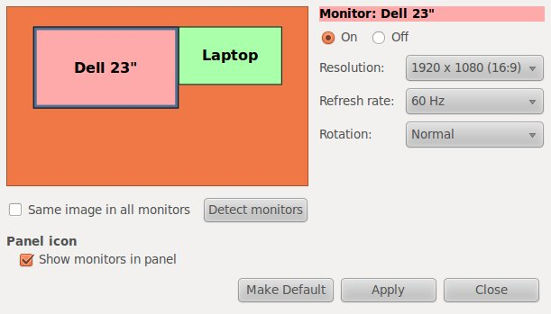

# Make your external screen your primary screen

Or how to move gnome panels to a different monitor in Ubuntu.

{ align=left width="200" }

In my particular setup, I have a laptop and a much larger external display. I like having my main Gnome panel on the external display and use the laptop display for other things like Skype and email.

To make this change perminant, I use some gConf magic:

`#!/bin/bash
gconftool-2 --set "/apps/panel/toplevels/top_panel_screen0/monitor" --type integer "1"
gconftool-2 --set "/apps/panel/toplevels/bottom_panel_screen0/monitor" --type integer "1"`

To reverse this, you can run this:

`#!/bin/bash
gconftool-2 --set "/apps/panel/toplevels/top_panel_screen0/monitor" --type integer "0"
gconftool-2 --set "/apps/panel/toplevels/bottom_panel_screen0/monitor" --type integer "0"`

The beautiful thing about this is that when on the go, Gnome will put the panels on your laptop display when the external display is not available.
