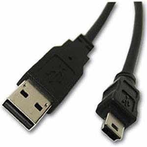

# USB console cable for Cisco Catalyst

{ align=left width="200" }

Cisco’s new line of equipment now use a mini-USB cable for console configuration. There is no longer a need for a USB to serial adapter or a [roll-over cable](http://en.wikipedia.org/wiki/Rollover_cable).

Connecting the USB cable on Linux should give you a new [ACM](http://www.mjmwired.net/kernel/Documentation/usb/acm.txt) device that looks something like this: “/dev/ttyACM0″.

To verify, you can also look through your dmesg or /var/log/messages :

`[265430.720082] usb 4-1: new full speed USB device using uhci_hcd and address 4
[265430.914246] cdc_acm 4-1:1.0: This device cannot do calls on its own. It is not a modem.
[265430.914305] cdc_acm 4-1:1.0: ttyACM0: USB ACM device`

The easiest way to connect to an USB capable Cisco device is to use screen, however you can still use minicom.

Screen command:
`screen 9600 /dev/ttyACM0`

The USB cable from Cisco is pin for pin the exact USB A to mini-B that you can find at your local electronics store.
