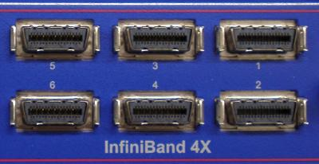

# Infiniband on Ubuntu 10.10 Meerkat

{ align=left width="250" }

My current project that involves hundreds of mini-ITX Atom machines and we are testing the performance difference between Infiniband and Intel Gigabit NICs.

In my testing the overhead of processing TCP is too high for a dual-core Atom. There is simply not enough processing power to handle the capabilities of the Intel NICs.

A possible solution is to replace TCP by using SDP (RDMA and Zerocopy) over Infiniband. Infiniband equipment has come down significantly in price ([dual port 4xSDR card](http://www.memoryx.net/mhea28xtc.html) for around $50), which makes it attractive to high-performance and cost-sensitive applications like mine.

In theory we can get 4xSDR speeds (8 Gigabit/s), but the tested result is 1.5 Gigabit/s speeds because of TCP processing over Infiniband. This is almost exactly the performance we achieved using the Intel NICs. We then replaced TCP with SDP over Infiniband. With the switch we saw 4.2 Gigabits/s performance on one process. With two processes, one for each core of the Atom, we saw 7.8 Gigabit/s which is close to the theoretical limit of the Infiniband NIC.
It is a significant improvement over the Intel NICs. The limiting factor is number of context switches and interrupts, as a single process would take up 100 % CPU usage. By running two processes we used both cores of the Atom and the full bandwidth of Infiniband.

Unfortunately Ubuntu does not ship SDP in its kernel yet and there is no way to compile just SDP. Our only option was "to throw the baby out with the bath water" by compiling from scratch and overwriting Ubuntu's kernel modules.

**Steps for a working Infiniband stack:**

1. Download OpenFabricAlliance (OFA) source package:
   `http://www.openfabrics.org/downloads/OFED/ofed-1.5.3/OFED-1.5.3.1.tgz`
2. Extract and look into srpm directory for the kernel package:
   `rpm2cpio ofa_kernel-*.rpm | cpio -idmv`
3. Extract it and step into the directory:
   `tar xf ofa_kernel-.tgz; cd ofa_kernel*`
4. Configure what modules to compile:
   `./configure --with-sdp-mod --with-core-mod --with-ipoib-mod --with-ipoib-cm --with-iser-mod --with-mlx4_inf-mod --with-mlx4_en-mod --with-mlx4_core-mod --with-mlx4-mod --with-mthca-mod --with-addr_trans-mod --with-user_access-mod --with-user_mad-mod`
5. Compile and install modules:
   `make; sudo make install`
6. add these to your /etc/modules file:
   `ib_mthca
   ib_ipoib
   ib_sdp`
7. Unload all running ib\_\* modules then load them again or reboot. The reason for this is to make sure you no longer running Ubuntu's IB modules, which will cause symbol conflicts.

Normal TCP usage:
`iperf -s`

To allow seamless SDP usage:
`LD_PRELOAD=libsdp.so iperf -s`

Please note that the shared library overrides the normal creation of sockets, but if SDP cannot be negotiated, then it defaults to TCP. That is why both ends need to LD\_PRELOAD libsdp.so in order for SDP to be used.

UPDATE: OFA changed their directory download directory structure and removed the stand-alone kernel source. You now have to download the whole package to get the kernel sources. Instructions are updated above.
