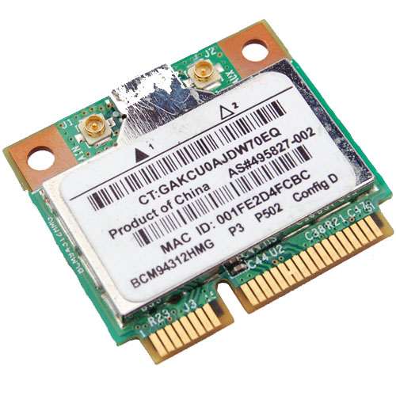

# Wireless BCM4312 on Ubuntu with 2.6.38 and 2.6.39 kernel

{ align=left width="200" }

My Vostro 1510 comes with an on-board wireless miniPCI card but it does not work "out of the box" with Ubuntu, even with the latest 2.6.39 kernel. The only option that works for me is the binary hybrid blob driver provided by Broadcom, but even that is out of date. They need help in order to work with 2.6.36 and upwards and I have a patch for that.

Chipsets supported by "Broadcom's IEEE 802.11a/b/g/n hybrid Linux® device driver" are: BCM4311, BCM4312, BCM4313, BCM4321, BCM4322, BCM43224, and BCM43225, BCM43227 and BCM43228.

The my exact chipset from lspci command:
> Broadcom Corporation BCM4312 802.11b/g LP-PHY (rev 01)

Below is the error I get with v5\_100\_82\_38 from Broadcom when compiling against 2.6.38 and 2.6.39:
> bcurtis@zwartevogel:~/Downloads/wl.org$ make
> KBUILD\_NOPEDANTIC=1 make -C /lib/modules/`uname -r`/build M=`pwd`
> make[1]: Entering directory `/usr/src/linux-headers-2.6.38-020638-generic'
> LD /home/bcurtis/Downloads/wl.org/built-in.o
> CC /home/bcurtis/Downloads/wl.org/src/shared/linux\_osl.o
> CC /home/bcurtis/Downloads/wl.org/src/wl/sys/wl\_linux.o
> /home/bcurtis/Downloads/wl.org/src/wl/sys/wl\_linux.c: In function ‘wl\_attach’:
> /home/bcurtis/Downloads/wl.org/src/wl/sys/wl\_linux.c:485:3: error: implicit declaration of function ‘init\_MUTEX’
> make[2]: \*\*\* Error 1
> make[1]: \*\*\* Error 2
> make[1]: Leaving directory `/usr/src/linux-headers-2.6.38-020638-generic'
> make: \*\*\* Error 2

To get your wireless adapter working again:

1. Download the 32 or 64-bit version:
   `http://www.broadcom.com/support/802.11/linux_sta.php`
2. Download my patch:
   [broadcom-sta\_4\_kernel-2.6.38.patch](../../assets/images/2011/03/broadcom-sta_4_kernel-2.6.38.patch)
3. Extract the sources:
   `cd ~/Downloads; mkdir -p wl; cd wl; tar xf ../hybrid-portsrc*-v5_100_82_38.tar.gz`
4. Patch the sources:
   `patch -p1 < ../broadcom-sta_4_kernel-2.6.38.patch
   make; sudo make install; sudo depmod; sudo modprobe wl`

Give Ubuntu a few seconds after loading the "wl" kernel module, then eventually the Network Manager will start looking for wireless networks.

Update: This patch and the resulting wl kernel module also works with 2.6.39 kernel series. I have updated content above to reflect this.
