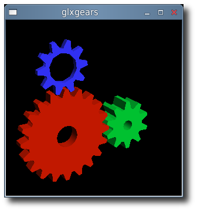

# Ubuntu 2.6.39 kernel and fglrx 8.831

{ align=left width="200" }

For those 10.10 Maverick users with 2.6.38 or 2.6.39 (64-bit) kernels, you can get fglrx playing nicely together with X.org 1.9.

Unfortunately this new driver does not support X.org 1.10 and that leaves 11.4 users to use the open-source drivers.

**Custom build procedure:**

1. Install the latest 2.6.38 or 2.6.39 kernel revision from [Ubuntu Mainline](http://kernel.ubuntu.com/~kernel-ppa/mainline/).
2. Download 64-bit [11.3](http://www2.ati.com/drivers/linux/ati-driver-installer-11-3-x86.x86_64.run) from [AMD](http://support.amd.com/us/gpudownload/linux/Pages/radeon_linux.aspx)
3. Extract the files from the package:
   `sh ./ati-driver-installer-11-3-x86.x86_64.run --extract ati`
4. For 2.6.38 and up, download these patches: [makefile\_compat.patch](../../assets/images/2011/03/makefile_compat.patch) and [2.6.38\_console.patch](../../assets/images/2011/02/2.6.38_console.patch)
5. For 2.6.39 support, download this additional patch: [2.6.39\_bkl.patch](../../assets/images/2011/03/2.6.39_bkl.patch)
6. Check for Big Kernel Lock usage:
   `` cat /lib/modules/`uname -r`/build/.config | grep -c CONFIG_BKL=y ``
   If the result of this command is 0, then download [no\_bkl.patch](../../assets/images/2011/03/no_bkl.patch) as well.
7. then apply them:
   `cd ati; for i in ../*.patch; do patch -p1 < $i; done`
8. Build your new ati/fglrx deb packages:
   `./ati-installer.sh 8.831 --buildpkg Ubuntu/maverick`
9. Install our newly created deb packages:
   `sudo dpkg -i ../fglrx*.deb`
10. If your /etc/X11/xorg.conf is missing you will need to run:
    `sudo aticonfig --initial`
    and then reboot.

That newly created package should work for the entire 2.6.38 or 2.6.39 series.
