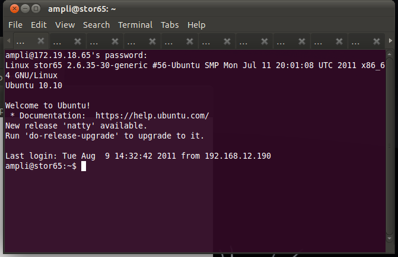

# Kabouter: a gnome terminal based multi-ssh connector

{ align=left width="200" }

[Kabouter](http://en.wikipedia.org/wiki/Kabouter) is Dutch for gnome and also a tool to connect to a range of IP addresses via ssh. It uses gnome-terminal to manage the sessions which, for me, seems more natural than some of the other 3rd party SSH applications available.

Usage is simple:

`bcurtis@ronin:~$ kabouter ampli 172.19.18.65 172.19.18.96`

This creates a gnome-terminal session with 32 tabs connecting to the range of SSH enabled machines. This works very well when using it with [SSH Multiplexing](https://mindwerks.net/2010/02/ssh-multiplexing-a-faster-way-to-ssh/) which then gives you a way to automate remote commands through SSH without needing secure key authentication and without having to authenticate each time you want to run a command.

Download: [kabouter](https://bitbucket.org/psi29a/kabouter)
