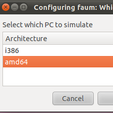

# Build environments using chroot

{ align=left width="200" }

The need was simple enough: make deb packages from source for multiple architectures on the same system. This needed to be done without the overhead of a virtual machine and without using something like [launchpad](https://launchpad.net/ "Launchpad").

I've used chroot in the past and it seemed like a perfect fit for the problem. The idea is to have at least two chroot-able directories with the bare essentials from Ubuntu Natty (10.04) to compile and build deb packages.
**Here is a simple way to accomplish this:**
`sudo apt-get install dchroot debootstrap
sudo debootstrap --arch i386 natty /opt/chroot_i386/ http://archive.ubuntu.com/ubuntu
sudo debootstrap --arch amd64 natty /opt/chroot_amd64/ http://archive.ubuntu.com/ubuntu
sudo chroot /opt/chroot_amd64
locale-gen en_US en_US.UTF-8
dpkg-reconfigure locales
exit
sudo chroot /opt/chroot_i386
locale-gen en_US en_US.UTF-8
dpkg-reconfigure locales
exit`

The next step is to update your apt repositories and get the latest updates and upgrades. Overwrite /etc/apt/sources.list in your respective chroots with the following:
`deb http://be.archive.ubuntu.com/ubuntu/ natty main universe multiverse restricted
deb http://be.archive.ubuntu.com/ubuntu/ natty-updates main universe multiverse restricted
deb http://be.archive.ubuntu.com/ubuntu/ natty-backports main universe multiverse restricted
deb http://archive.canonical.com/ubuntu natty partner
deb http://security.ubuntu.com/ubuntu natty-security main universe multiverse restricted`

In each chroot we update to latest packages and install our build environment.
`apt-get update
apt-get dist-upgrade -y
apt-get install build-essential`

While you are setting up one chroot environment and you want to mirror the installed packages in another chroot, then you can do the following.

**Make a list:**
`dpkg --get-selections > installed-software`

**Use list to install necessary packages:**
`dpkg --set-selections < installed-software
dselect install`

This should get you going for compiling and building in separate environments. This technique could also be used for non-debian based distributions as well.
