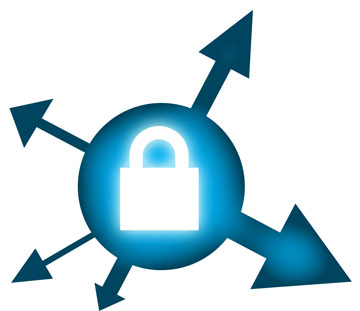

# A poor man's https, using ssh to secure web traffic

{ align=left width="200" }

Sometimes you get a web-hosting environment that only serves non-ssl (http) content. If you need to do any type of management through tools like phpMyAdmin, then you can see the problem with this. All it would take is someone on your network or on the Internet to sniff the traffic and retrieve your username and password, then they too can do a bit of "management" on your site.

If you also have secure shell (SSH) access, then there is a way to manage your site securely by using SSH's venerable port forwarding (SOCKS). The trick is to tell your management tools to only listen or respond to connections coming in over SSH instead of normal traffic.
First you need to set up your SSH connection and configure your browser to use your newly made SOCKS proxy. Please refer to my post about [SSH Proxies](https://mindwerks.net/2011/12/ssh-as-a-socks-proxy/ "ssh as a socks proxy") for more information.

The second part is to secure your application to only accept connections from itself, which is where your browser requests travels through your secure tunnel. We can mask it a bit so that you will have to look hard to see that there is something of interest going on there. It will also be ignored by Google and other search engines.

You can add this to your php code:
`/* custom code to deny access to world */
if ($_SERVER["SERVER_ADDR"] != $_SERVER["REMOTE_ADDR"]){
header('HTTP/1.1 404 Not Found');
exit();`

If the remote IP (your request) is not he same as the server IP, then we give the 404 error message in return, otherwise you get to your application.
