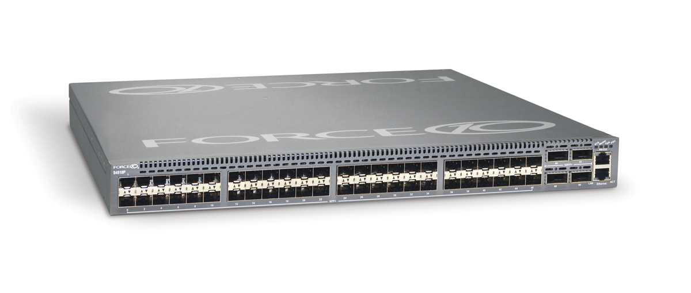

# Switch your switch with switches

{ align=left width="200" }

It is not unusual for me to find 10,000 Euro worth of networking equipment on my desk one day. It usually means that I have a long week of reading and testing ahead of me as I am the only person in the company, let alone building, that has ever seen or worked with these devices before. That means I am on my own aside from an Internet connection.

While your mileage may very, I've had the joy (and horror) of testing these devices as 'drop in replacements' to the test environment that we are using. In some instances, things just worked out of the box, however there are a few devices that needed to be poked a few times to get things moving.

Manufactures of routers and switches I have tested are:

- [Arista](http://en.wikipedia.org/wiki/Arista_Networks): We where able to test the Arista 7000 to validate it against our setup. Painless to install and without tweaking, handed Cisco's 3560-X it's hat. The latency (cut through as opposed to store and forward) helped and the overall throughput was great.
- [Brocade](http://en.wikipedia.org/wiki/Brocade_Communications_Systems): SSE-X24S was a interesting 24 port 10Gbps switch, we where however unable to capture the same level of performance as the Arista.
- [Cisco](http://en.wikipedia.org/wiki/Cisco): Tried and tested Cisco and their IOS that every switch tries to emulate. Everything we've tried to do with Cisco devices just worked. What is better is that they abandoned their serial and have gone USB. That cannot be said for the rest of the devices we've tested. We where limited to just 2 10G ports per 3560 switch, which is a shame.
- [Extreme Networks](http://en.wikipedia.org/wiki/Extreme_Networks): After meeting with their technical sales people, they (twice) gave us the wrong equipment. We ask for 48 port 1Gbit (Cat5) with 4 10Gbps SFP+ switch and we received a 48 prt 1Gbit SFP which was later replaced with what we needed but with only 2 10Gbit SFP+. After a month of being unable to test their product(s) in our environment, we stopped dealing with Extreme Networks and their purple hardware.
- [Force10](http://en.wikipedia.org/wiki/Force10): lived up to its expectations as a force to be reckoned with. Nothing worked at first as all the ports are shutdown by default. You must first use a usb->serial->rollover cable to get in, 'no shutdown' your ports and then tell them they are 'switchports', at which point they should start switching packets. Same level of performance as the Arista, meaning that we could saturate our 10Gbps nics.
- Interface Masters: the Niagara 2924-24TG switch was the latest to be tested and there isn't much information about them online. Their switches (24x 1Gbps and 24x 10Gbps) where comparable if slightly less performant than Force10. Their plus point was that they allow you to re-brand their products. We experienced hardware fault in their 10Gbps port, we used another port and continued testing. Their technical support was good but we never got to deep dive into why that one port had so many problems. They sent us a new switch to test and everything worked out.

There is also an issue with SFP+ cable length and Intel cards:
> This issue has been witnessed at Intel's POC using 10Gbps Intel NIC and Arista DCS-7048T-A switch.

The INTEL LAN department has analyzed that there is a known issue with short SFP+ cables, leading to a flicker in the network signal. Apparently there needs to be a minimum length of 3m.

Replacing all 0.5 m cables with 3m cables solves the issue.

For those looking for some numbers and benchmarks, I'm not allowed to post the results. Needless to say, they are not far off from my experiences that I've listed above. I'm now a fan of Force10 being reliable and performant. Arista ranks up there as well and Interface Masters (a total unknown) can be competitive and allow for re-branding which is interesting for some companies.
