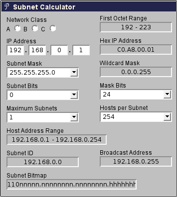

# Finding and making a network subnet calculator

{ align=left width="150" }

Doing subnet calculations by hand can be tedious and thankfully there are tools available online to help with that. One in particular [Subnet Calculator](http://www.subnet-calculator.com/ "Subnet Calculator") with a PHP backend was handy and compact.

I've sent a few requests asking if I could re-write it to be client side so that it could be used in intranet applications or even possibly be ported as an hand-held application. After a few months of waiting and no response, I repurposed some of their CSS and layout and wrote the javascript equivalent.

[Mindwerks's Subnet Calculator](https://mindwerks.net/online-tools/ip-calc/ "Subnet Calculator")

The code is released as open source and can be reused as per terms of the license. It is part of the WP-Mindwerks wordpress plugin, but you can use it also as a standalone webpage.

ipcalc
