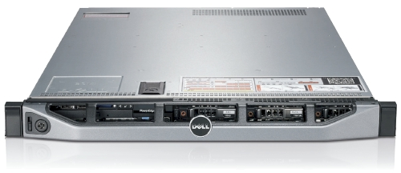
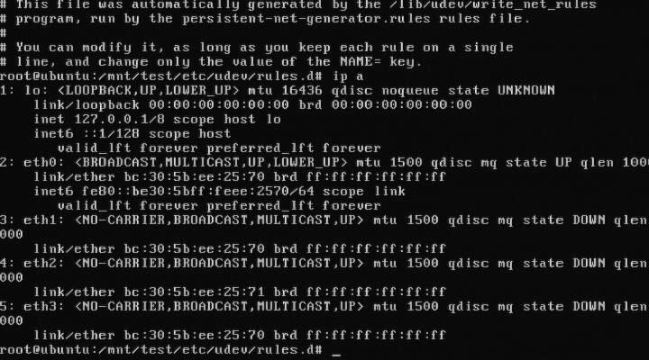
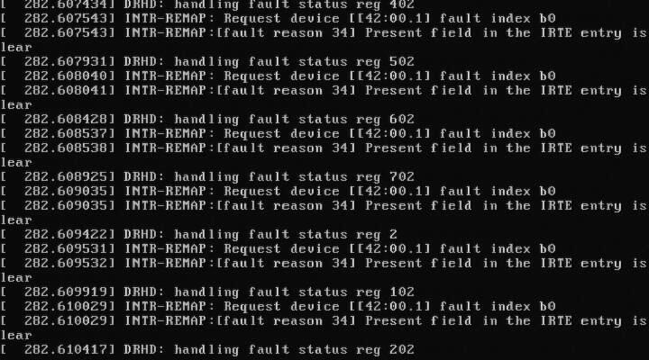

# Doing battle with a Dell R620 and Ubuntu

{ align=left width="200" }

 We recently got sent a [Dell R620](http://www.dell.com/us/enterprise/p/poweredge-r620/pd) to evaluate and while its technical specification is amazing there are a few things that need to be handled first.

As far as Ubuntu and the Dell R620 go, Precise (12.04) is the only way to go here. Every release before Precise has issues with this hardware in one way or another. This is new hardware of after all.

For our "use case" we downgraded the PERC H710P controller to a H310 controller so we can have direct access to the drives via pass-through. The H310 allows TRIM support for SSDs and SMART data via smartctl to be used without any problems. If you are interested in SMART information and PERC H700 series RAID controller, I posted about possible workarounds at [Dell's customer support site](http://en.community.dell.com/support-forums/disk-drives/f/3534/p/19431245/20029690.aspx).

Let's begin:
**USB Booting**: try as we might, we could not get any usb stick to boot on the R620. We've gone through the iDRAC to do virtual drives and looked at BIOS/UEFI methods. The usb stick is recognized, but the R620 just shows us a blank screen. The same stick works in the R610, VM and other machines. We have a ticket with Dell support and they have yet to resolve the problem. Booting over PXE or CD/DVD are our only options at this point.

{ align=left width="200" }

**Intel® Ethernet Server Adapter I350-T4**: The igb kernel module for 2.6.35 and 2.6.38 will detect this card and it will get you connectivity, but it will behave funny. For example, 3 to 4 ports will have the same MAC address. You need download, compile, and install the latest sources for the [igb](http://sourceforge.net/projects/e1000/files/igb%20stable/) from Intel before you get full functionality out of your I350-T4. The other option is to install Ubuntu Precise (12.04) as the 3.2 kernel has the updated drivers from Intel.

**DRHD: handling fault status reg**: at some point during booting of a freshly installed Ubuntu with the 2.6.35 kernel, we ran into this error that would effectively loop endlessly and cause the R620 to become unresponsive. We got this:

{ align=left width="200" }

> DRHD: handling fault status reg 502
> INTR-REMAP: Request device[[42:00.1] fault index b0
> INTR-REMAP:[] Present field in the IRTE entry is clear

and it would endlessly print that to the console. This apparently has something to do with the IO-MMU part of the kernel dealing with interrupt remapping. Whatever the problem was, it was fixed in the 2.6.38 kernel and caused no more problems.

**Dell SSD**: the SSDs are rebranded Samsung drives which do not support TRIM but are at least over provisioned. These drives have a problem with smartctl in that while there is SMART information, the drive itself doesn't (yet) exist in the drivedb.h file. You have to use the latest [smartctl](http://sourceforge.net/projects/smartmontools/files/smartmontools/) version (5.42) to get anything usefull out of the drive. Older versions give you things like this:
> Log Sense failed, IE page

**hdparm**: and other tools like smartctl, lshw and others have issues when getting the required data from over the PERC H310, even if it is pass-through. You have to use the latest versions of each to even read the serial number off a HDD or SSD. [Hdparm](http://sourceforge.net/projects/hdparm/files/hdparm/) versions >= 9.37 work, otherwise you get this:
> root@node:~# hdparm -I /dev/sda

/dev/sda:
HDIO\_DRIVE\_CMD(identify) failed: Invalid exchange

Once we got all the little inconveniences out of the way, we got down to benchmarking and performance testing. In comparison to the Dell R610's 2x Xeon(R) E5606, the R620's 2x Xeon(R) CPU E5-2643 has double the CPU performance in our testing. The obvious bottleneck here are the 2x 2port 10Gbps NICs in that even at a theoretical max of 40Gbps, for our purposes, we would be network bound. Thankfully there is another PCI-Express available, just in case.
