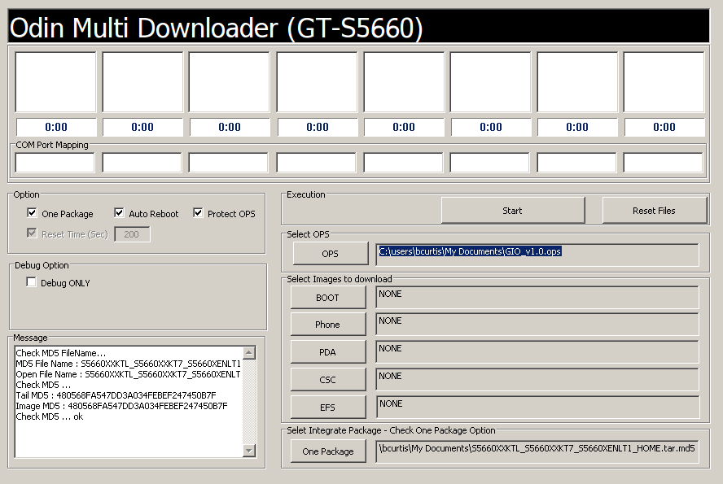
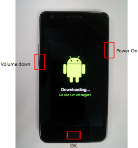

# Upgrade Samsung Galaxy Gio from 2.2.x Froyo to 2.3.x Gingerbread

{ align=left width="200" }

Going from 2.2.x (Froyo) to 2.3.x (Gingerbread) is an involved process as there is always the fear that you will 'brick' your phone. This fear usually keeps most people away from upgrading. I've found a process, with Google's help and trial/error, that managed to get process done painlessly and without a dead mobile.

Here is a little back story: I was lucky enough to come across the Galaxy Gio in a bad state while at work. The mobile would turn on, give the Samsung logo then black-screen and would not boot any further. It wouldn't have made a good paperweight but if I could salvage it, it was mine.

Note: This process is a requirement before upgrading to a Cyanogenmod release.

**What you need** 

- Galaxy Gio
- Micro USB Cable
- [Samsung's USB Driver](http://www.mindwerks.net/wp-content/uploads/custom/samsung_usb.zip "Samsung's USB driver")
- [Odin with 'pit and ops' file for Gio](https://web.archive.org/web/2015/https://mindwerks.net/wp-content/uploads/2012/08/odin.zip)
- Windows OS to run ODIN on
- [Gingerbread Rom](http://www.sammobile.com/firmware/?page=3&model=GT-S5660&pcode=0&os=1&type=1#firmware)

You will need to download the Odin installer with the 'pit and ops' file which is specific to the Galaxy Gio. This process requires Windows and I have yet to find a process that will work under Linux. When browsing above for a 'Gingerbread Rom' be sure to pick one for your country or region. The latest revision as of this writing is: 2.3.6

**The upgrade process**

1. If you have not already, you will need to install Samsung's USB Driver.
2. Power off your Gio and remove your SIM and SD cards.
3. Unzip/extract your rom, the result should be a 250MiB MD5 file. As an example: S5660XXKTL\_S5660XXKT7\_S5660XENLT1\_HOME.tar.md5
4. Unzip/extract odin.zip somewhere and run the ODIN executable.
5. Select OPS file that you just extracted from odin.zip. Select 'One Package' under Option and then a few options will be greyed out. Keep 'Protect OPS' and 'Auto Reboot' checked. Select your 'One Package' at the bottom to be the 250MiB tar.md5 file.

{ width="300" }

- Set your Gio to 'Download Mode' by pressing 'Volume Down + OK + Power' at the same time.

{ width="200" }

- Connect the phone to the PC with your USB cable. Your COM port mapping will turn yellow when the device is properly detected and connected.
- Press 'Start' and do not turn off your mobile!
- Wait about 5 minutes ( could take longer ), when finished the 'PASS' will show up on the left when the upgrade was successful. Your Gio will reboot automatically.

You should now have a Gio with Gingerbread. You'll need this you wish to try the latest Cyanogenmod releases.

**This is part 1 of a 3 part series about the Galaxy Gio.**
Part1: [Upgrade Samsung Galaxy Gio from 2.2.x Froyo to 2.3.x Gingerbread](https://mindwerks.net/2012/08/upgrade-samsung-galaxy-gio/ "Upgrade Samsung Galaxy Gio from 2.2.x Froyo to 2.3.x Gingerbread")
Part2: [Upgrade Samsung Galaxy Gio to CyanogenMod 7.2](https://mindwerks.net/2013/01/upgrade-samsung-galaxy-gio-to-cyanogenmod-7-2/ "Upgrade Samsung Galaxy Gio to CyanogenMod 7.2")
Part3: [Upgrade Samsung Galaxy Gio to CyanogenMod 10.1](https://mindwerks.net/2013/05/upgrade-samsung-galaxy-gio-to-cyanogenmod-10-1/ "Upgrade Samsung Galaxy Gio to CyanogenMod 10.1")
