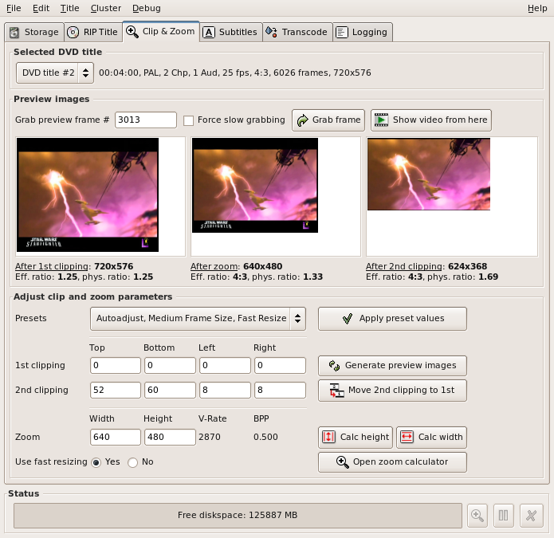
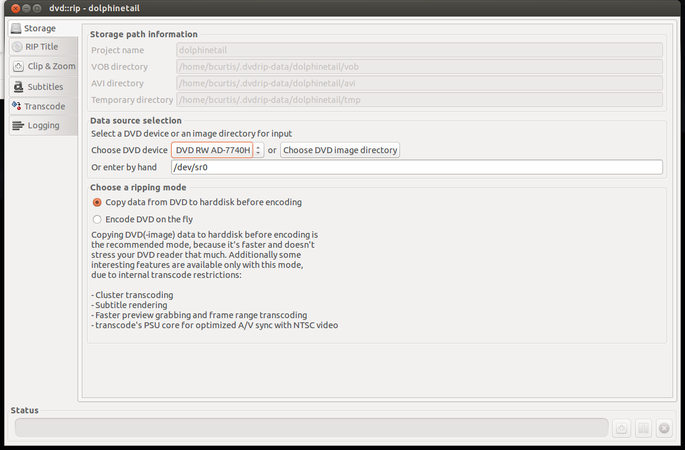
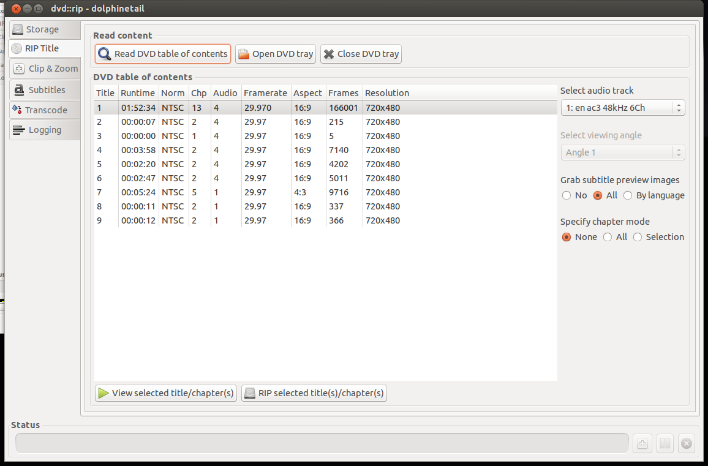
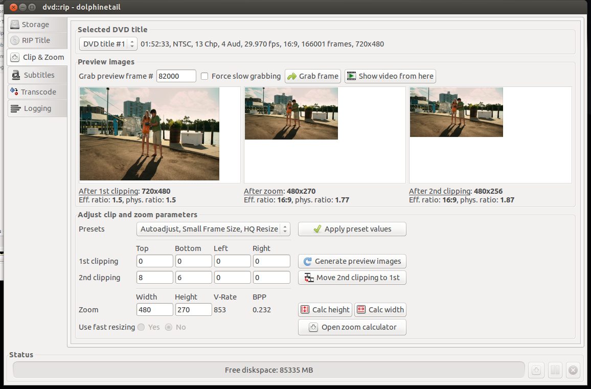
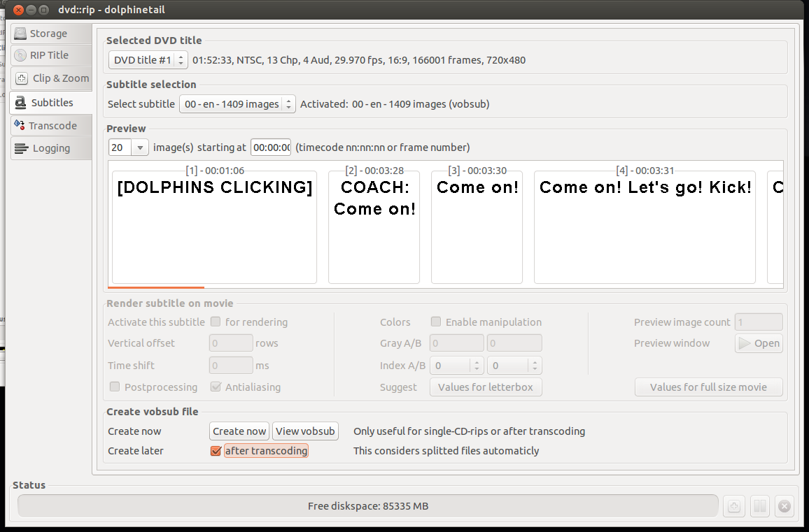
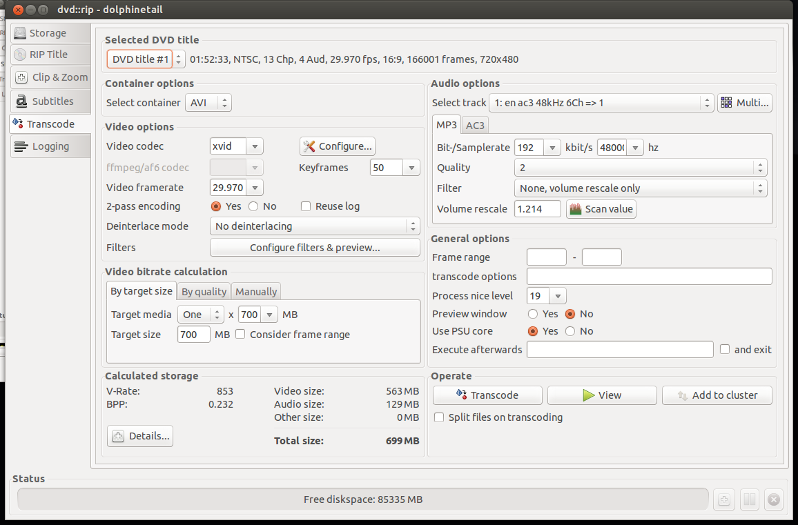

# Properly ripping DVDs and adding subtitles in Ubuntu

{ align=left width="200" }

There are occasions where you legitimately need tools to help that would otherwise be considered the domain of "pirates" and "ne'er-do-wells". In this particular scenario, my grandparents send a DVD from the United States (Region1) to us in Belgium (Region2). Not only will the DVD not play back on a region locked DVD player, there are also no Dutch subtitles.

There are however technological solutions to this type of problem, including such programs as [dvd::rip](http://www.exit1.org/dvdrip/ "dvd::rip"), [vobsub2srt](https://github.com/ruediger/VobSub2SRT#readme "VobSub2SRT") and a few websites dedicted to crowdsourced subtitles.

Our first task is to properly rip a DVD. There are many options here, but I chose dvd::rip because it just works. It creates a small [xvid](http://en.wikipedia.org/wiki/Xvid "Xvid") (avi) file that is compatible with a set-top DVD player and it is also allows ripping of any subtitles found on the DVD. If may wish to dig into the [documentation](http://www.exit1.org/dvdrip/doc/index.cipp) to really understand the details of dvd:rip. I'll give you a step-by-step run down on how I did things.

**dvd::rip**

1. Install the program and it's libraries.
2. Following the directions and make sure the directories are set, dvd drive is found and that libraries are installed.
3. On the left will be tabs, use this as a process. Begin with "Storage" where you set the project name, dvd drive to use and "Copy data from DVD to hard disk before encoding" which will make things faster.

{ width="200" }

4. On "Rip Title" you need to read the data on the DVD and select which files to rip. First "Read DVD table of contents", select the Title or Titles you wish to rip, usually the one with the most Chapters and/or Runtime is your target. Highlight that entry, select on the right your audio track (en for English, other en entries are usually commentary tracks). Set "Specify chapter mode" to None so that it is ripped as one file and not a set of files (per chapter) and set the "Grab subtitle preview images" to All so that you can select what subtitles you wish use, if any. The last step here is to "Rip selected title(s)/chapter(s) which will take a few minutes.

{ width="200" }

5. Select next the "Clip & Zoom" which will allow you to set the correct format (size) that is perfect for your TV. You need to be careful here because the source (DVD) can be different such as: letterbox (widescreen) 1.85:1 ratio, anamorphic (widescreen) 16:9 ratio, or pan & scan (fullscreen) 4:3 ratio. Look at the back of your DVD box to verify. To test different settings, do a grab frame and try various "Autoadjust" presets until you find something that looks right. If you are playing back on an older DVD player with USB divx/xvid/avi support, then try to pick Small Frame Size, which is about 480p. This will make playing back smother as your hardware DVD player doesn't have enough CPU power to downscale higher resolutions.

{ width="200" }

6. Moving to the Subtitles screen, you can select the DVD title that you ripped and the correct subtitle you wish to rip. You can either "Activate this subtitle" for rendering or "Create now" which will produce separate files which you can use later. I prefer another method of handling subtitles than hard-rendering them to the rip. After "Create Now", you will have extra files that we can convert to [SubRip](http://en.wikipedia.org/wiki/SubRip) text file format (SRT) later.

{ width="200" }

7. After that we go to the "Transcode" tab which is the 'meat' of the program. We select our DVD title, select a container of AVI, make sure the "Video codec" is xvid, "By target size"'s "Target media" to One x 700MB which will create one file at an acceptable bitrate. On the Audio Options side, "Select track" to the one we ripped and select MP3. I set the Samplerate to 192kbit/s to get better audio. the rest I set to defaults. On the bottom left gives you an "Calculated storage". If you are content with your choices, go to "Operate" and select "Transcode" and wait a bit more.

{ width="200" }

8. Success! Try out your newly made AVI file with VLC or another player to make sure it is to you liking. If you got an error, you can go to the "Logging" tab on the left and see where you went wrong.

At this point, you should have an AVI file that you can play back in your video player or DVD player. However the job is not yet finished as we also need the subtitles for those in their native language. We saw that we could 'Rip' subtitles with dvd::rip but the files we have are in the VOB format idx/ifo/sub format which may or may not be readable by your player. We can convert this format to a SRT text-based file which is widely supported subtitle format using a tool called: [VobSub2SRT](https://github.com/ruediger/VobSub2SRT "VobSub2SRT").

**VobSub2SRT**

1. Download and build [VobSub2SRT](https://github.com/ruediger/VobSub2SRT "VobSub2SRT") yourself or install the package via [PPA](https://launchpad.net/~ruediger-c-plusplus/+archive/vobsub2srt "vobsub2srt").
2. You will also need to install '[tesseract-ocr](http://en.wikipedia.org/wiki/Tesseract_(software))' and any of the language files necessary to handle the subtitle language you ripped earlier.
3. From the command line, go to where your ripped subtitles are and run the command to convert (OCR) them into an SRT file.

> vobsub2srt --lang en dolphinetail-001-sid00

This will use english (en) from the idx/sub files to make the srt file. You can find out which languages you can pick from using the --langlist parameter.

> bcurtis@Wintermute:~/.dvdrip-data/dolphinetail/avi/001$ vobsub2srt --lang en dolphinetail-001-sid00
> Selected VOBSUB language: 0 language: enen
> Wrote Subtitles to 'dolphinetail-001-sid00.srt'

Success! Just copy the SRT file to where your AVI is and your player should recognize and automatically use the subtitle file.

There are times when you have the film but there is not subtitle for your language of choice. This is where crowd sourcing comes in as there is no shortage of people wanting to either subtitle the film for free as volunteer work or for some other altruistic or non-altruistic reason.

**Crowdsourced Subtitles**

- [Bierdopje](http://www.bierdopje.com/ "Bierdopje"): Dutch subtitles for films and series.
- [OpenSubtitles](http://www.opensubtitles.org/en "opensubtitles"): Multi-lingual subtitles for films and series
- [Podnapisi](http://www.podnapisi.net/ "podnapisi"): Older Multi-lingual subtitles for films and series

**Resizing Video**
There can be moments where you have a file you want to play back on your DVD player and it complains that the resolution is not supported. This because it doesn't have a CPU powerful enough to downscale your film to your TV's resolution. I found this Video [Conversion Guide](http://ubuntuguide.org/wiki/Video_Conversion "Video Conversion") which helped. You just need to figure out what your TV's native resolution is, and try to match it. For example my TV is an old CRT PAL monster and the source is a 1280x720 video. The DVD player doesn't support that resolution, but it is 16:9 ratio. We then convert the mkv to an avi to stay within the same ratio and play back on an old style PanScan CRT.
> mencoder input.avi -ovc xvid -vf scale=648:364 -oac mp3lame -lameopts cbr:br=192 -xvidencopts pass=2:bitrate=-1400000:threads=4 -o output.avi

This converts the film 648:364, however you should keep in mind your TV's resolution. The guide gives a better understanding and there is no need to repeat the information here.

The end result should be a film for your USB in with a subtitle of your choice.
