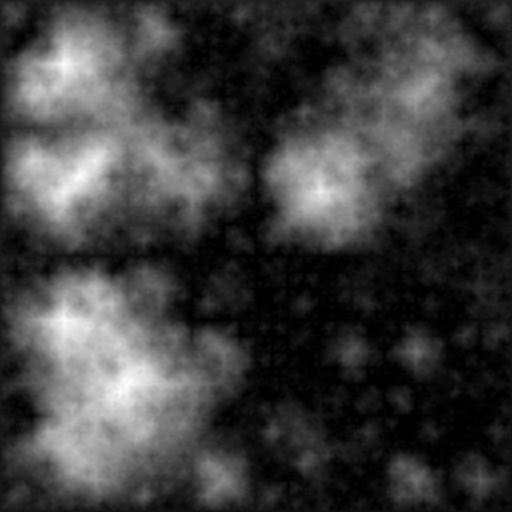
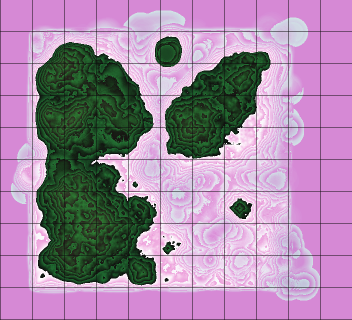
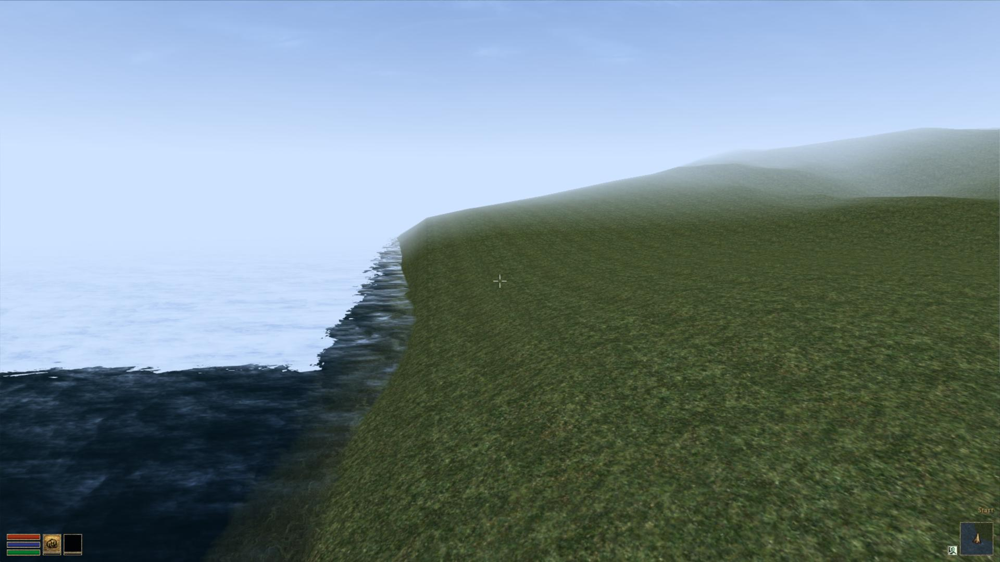
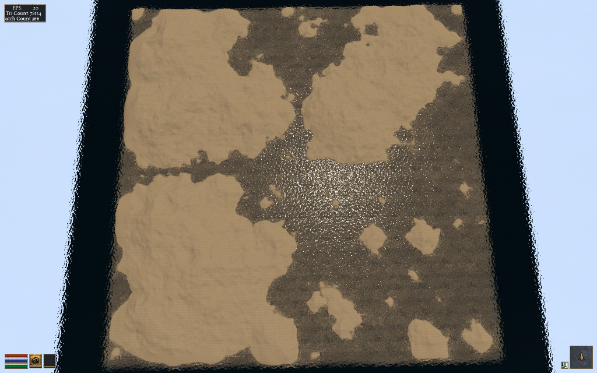
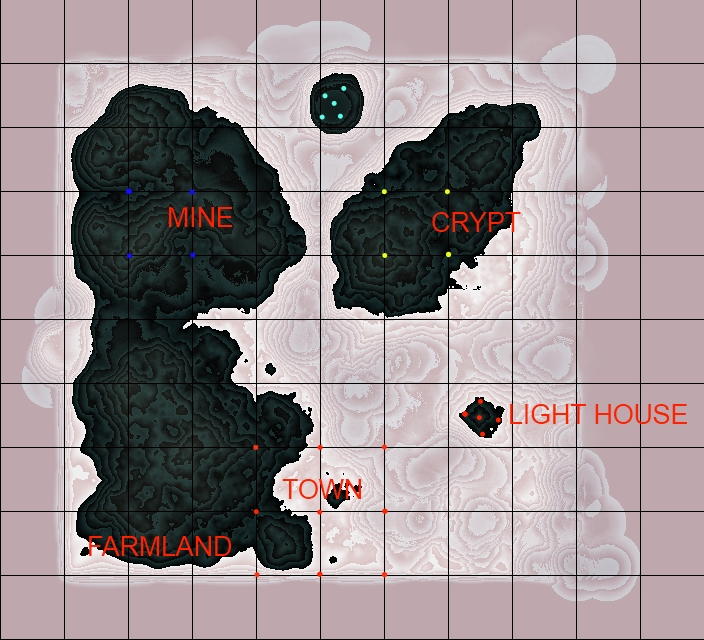
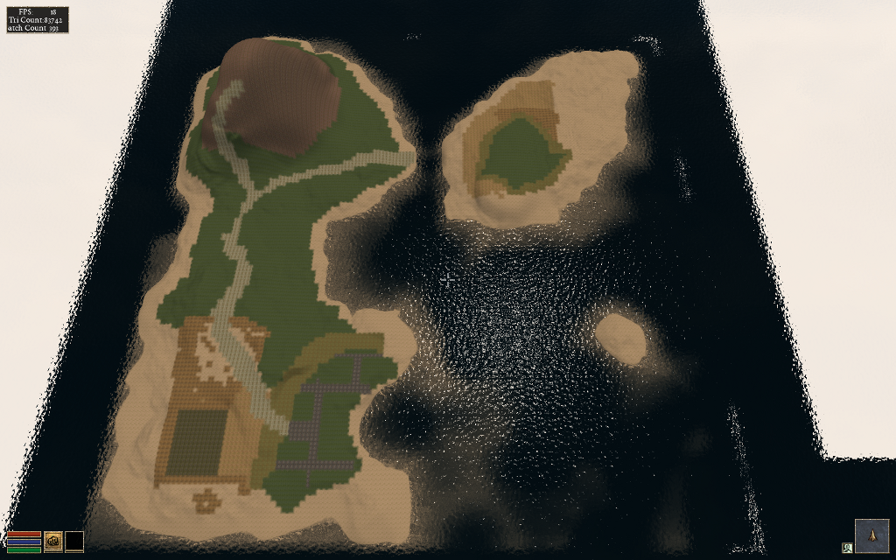

# Introducing worldsynth for your world generation and building needs

{ align=left width="200" }

After many years of development in my spare time, I've decided to release [Worldsynth](https://mindwerks.net/projects/worldsynth/ "Worldsynth: A World Synthesizer") as a [Free and Open Source Software](http://en.wikipedia.org/wiki/Free_and_open_source_software "Free and Open Source Software"). As a world generator, it fills the roll and can also be rapidly extended to support additional features. The source might not be of top quality, but the main purpose of creating it has been fulfilled and I want to share it. I only hope that others will find it useful and want to build upon it.

There is still much more functionality that I would like add and additional polishing to the user interface. Midway through I switched from [pygame](http://en.wikipedia.org/wiki/Pygame) to [pyside](http://en.wikipedia.org/wiki/PySide) or [Qt4](http://en.wikipedia.org/wiki/Qt_(framework)) for the GUI. I consider it ready for "[Alpha](http://en.wikipedia.org/wiki/Software_release_life_cycle#Alpha)" at this point, meaning there might be bugs and few experimental features that may break but otherwise usable.

**What we have so far:**

- *Heightmap* - What we have so far is the ability to create a heightmap using three different methods: midpoint displacement, sphere slicing and diamond square. Each have their advantages and disadvantages depending on the type of terrain map you desire.
- *Heatmap* - Based on the heightmap we generate a heatmap to get our temperature range across the terrain, either full equatorial or picking between northern or southern hemispheres.
- *Weather* - There is wind and precipitation that are heavily influenced by the contours of the terrain. This includes rain shadows from mountains and average rainfall based on wind direction.
- *Drainage* - The drainage dictates how fast the water is absorbed by the terrain. This has in impact on the type of geology that is there such as soft ground good for farming or hard stone that water just flows over with little erosion.
- *Rivers* - With the rain water that collects when falling down the mountains and hills of the terrain, at a certain point to form streams that collect further into rivers. It flows either out to sea or collects into a depression of the terrain. This also has an impact on erosion on the terrain.
- *Biomes* - With all the layers above we can then synthesize [biomes](http://en.wikipedia.org/wiki/Biome) which give a sort of realistic habitation zones that we find in real life.

**Media**:
I've made films of older versions [Worldsynth](https://mindwerks.net/projects/worldsynth/ "Worldsynth: A World Synthesizer") to give an idea of what is possible. The GUI has since changed from pygame as of version 0.8 to pyside in version 0.9, but the main features haven't changed. The follow video demostrates all the major features talked about above.
http://www.youtube.com/watch?v=INfN3IXwwzg

The next video is older but still gives another demonstration.
http://www.youtube.com/watch?v=Sixm7dd9klY

**Outside interest**:
Other projects have already taken an interest in [Worldsynth](https://mindwerks.net/projects/worldsynth/ "Worldsynth: A World Synthesizer") and have used the results for building their own worlds. [OpenMW](https://openmw.org "OpenMW") is a FOSS remake of the [Morrowind](http://en.wikipedia.org/wiki/The_Elder_Scrolls_III:_Morrowind) game engine that will let you play Morrowind on multiple platforms. They are also working on a OpenCS which will be better than the Morrowind Construction Set, win parallel with an OpenES or "Example Suite" that will allow anyone to use OpenMW without having to own Morrowind.

They first had to generate a heightmap that fit their requirements, three relatively big islands in a 512x512 map.

{ width="300" }

{ width="300" }

Once they had a heightmap that they could work with, they did a test conversion into an usable ESM for OpenMW. They used a tool made by Lightwave called [TESAnnwyn](http://www.oceanlightwave.com/morrowind/TESAnnwyn.html) which allow for the creation of an ESM using the heightmap. I've talked with Lightwave about open-sourcing his work, and he replied that it would love to but first needs to clean it up. He did provide Linux 32 and 64 bit versions of TESAnnwyn that I'm allowed to host until he can get around to it. [tesannwyn\_linux.tar](https://web.archive.org/web/2015/https://mindwerks.net/wp-content/uploads/2013/02/tesannwyn_linux.tar.gz)

The result is a success!

{ width="300" }

{ width="300" }

With this they can plan out what they want to do and where things should go before editing.

{ width="300" }

The ESM was put into the editor to mold their new world. I would love to add some of that very functionality into [Worldsynth](https://mindwerks.net/projects/worldsynth/ "Worldsynth: A World Synthesizer"). The result of their modeling is this.

{ width="300" }

They are still building and creating, but this drop in replacement for Morrowind (Example Suite) is coming along fine. You can have a look for yourself as they provided me with a demo ESM you can use. Place [OpenMW.esm](https://web.archive.org/web/2015/https://mindwerks.net/wp-content/uploads/2013/02/OpenMW.esm.tar.gz) in your "Data Files" directory next to Morrowind.bsa. Rename Morrowind.esm so that it is out of the way and copy OpenMW.esm to Morrowind.esm. With OpenMW, use the launcher and select OpenMW.esm in the "Data Files" tabs. Close the Launcher then on the command line type this:
`openmw --start="Town, Centre"`
Once in, hit f2 to open the console and set your speed so you can fly around and view the work that is going on with the Example Suite.
`player->setspeed 500`

This is very good for moral here as people are actually using [Worldsynth](https://mindwerks.net/projects/worldsynth/ "Worldsynth: A World Synthesizer") for their own projects. It is possible that they will ship it with their OpenCS or at least link against it for their heightmap generation needs.
