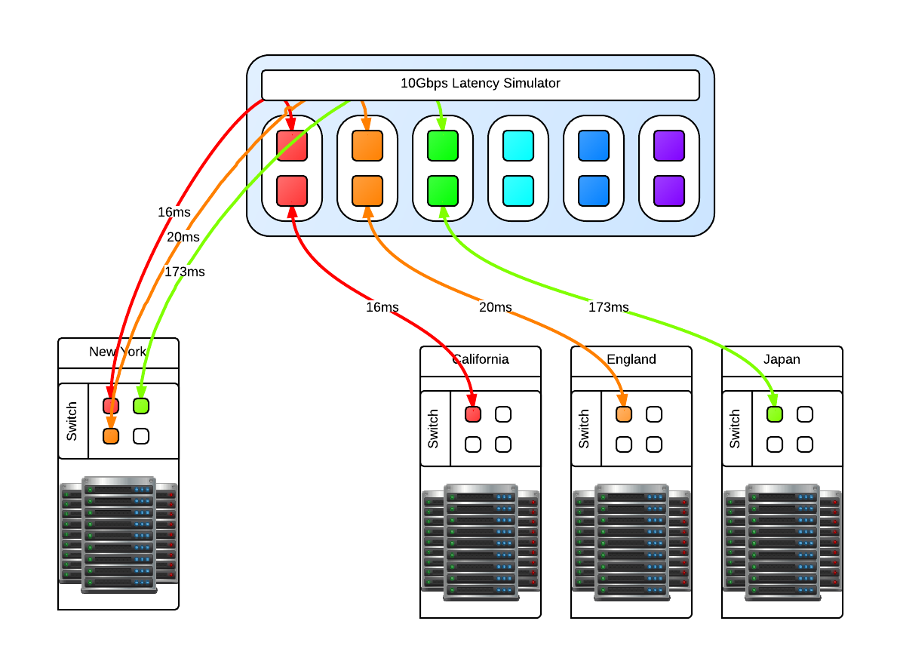
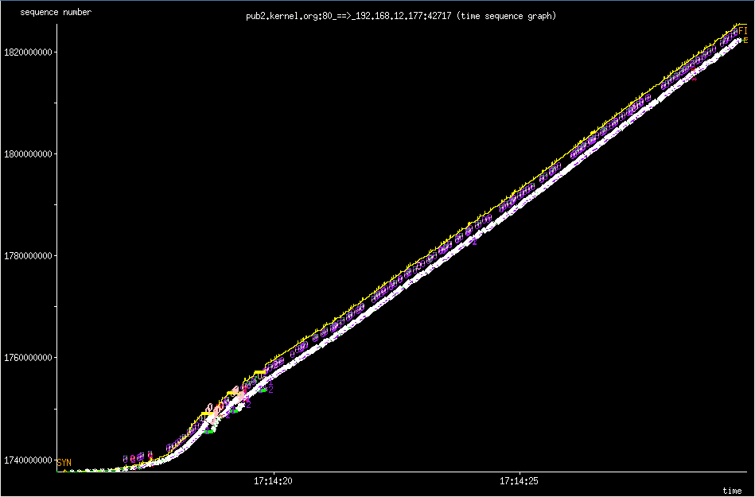

# Latency simulation over long fat network

{ align=left width="200" }

One of our clients asked us how we handle latency, and not just a few ms across racks but 2 and even 3 digit ms latency that indicates geographically separate locations across continents, not just a country. Not only that, the "pipes" involved are 10Gbps and we had to fill them. We have the theories and made models of how it would work. We perhaps might not be able to fill a 10Gbps fully with one stream, we could fill it with multiple streams but we had to validate this conclusion.
The question now becomes, how do we test this. We've done our research and there are only a few commercial solutions available like the [Netropy 10G2](http://www.apposite-tech.com/products/netropy-10G2.html) which is a 4 port, 2 lane hardware latency simulator for $30,000 new. Not only is that outside my budget, it is still limited to simulating 2 10Gbps pipes while we need at least 3 lanes (6 ports) and possibility to expand to more as necessary. We decided it was cheaper in terms of total cost to put the research into creating our own Latency Simulator.
We studied what we could from google, specifically the work done by NASA on a "[Channel Emulator](http://channel-emulator.grc.nasa.gov/)". They used [traffic control](http://www.lartc.org/) ([tc](http://linux.die.net/man/8/tc)) to handle delay on the egress of an interface. This means that if a packet travels through, it is delayed but the return packet is not and goes right through. Our setup means that we have one 10Gbps card with 2 ports. We then link the two interfaces with bridge control (brctl) to create a layer2 bridge. We then split the "round trip time" or RTT delay and apply that to each 10Gbps interface. All packets going to and returning from a network then have the full simulated RTT delay. This type of machine does not need much in the way of RAM as the buffers necessary are not large, 4GiB is sufficient. What is important is the CPU operating frequency, all other aspects of the CPU is not important except that there should be 1 core per 10Gbps interface. This is required because part of the network stack is being simulated with the bridge then processed. For a 3 lane setup, that is 6 ports so we need at least a 6 core CPU @ >= 2.2 Ghz to handle the load.

{ width="300" }

You may be asking why just 3 and not 4 latency lanes, this is because for us there will always be a 'local' data center and the other 3 connect to it in a star like network layout like in the above diagram. Since this is a 'flat' network in the same subnet, any ping from one of the data centers to another data center will go through the 'local' data center. In reality, these 'data center' switches are connected to the Latency Simulator which then connects to the local data center switch.
Realistic latency from the 'local' data center in New York:
**California**: 32ms
**England**: 80ms
**Japan**: 346ms
Source: [Verizon's latency table](http://www.verizonenterprise.com/about/network/latency/)
Going from California to Ireland would involve first a hop through New York, so the compound delay would be 112ms. With that in mind you can then compute your [bandwidth delay product](http://en.wikipedia.org/wiki/Bandwidth-delay_product) (BDP)
Once the machine is up and running with whatever Linux distribution you like, make sure that tc and brctl are installed. Here are the scripts that can be used to bring the bridges up and down, and apply latencies and remove the latencies for the four geographically seperate datacenters.
**Files:**

- [bridgeUp.sh](../../assets/images/2013/02/bridgeUp.sh)
- [bridgeDown.sh](../../assets/images/2013/02/bridgeDown.sh)
- [latencyOn.sh](../../assets/images/2013/02/latencyOn.sh)
- [latencyOff.sh](../../assets/images/2013/02/latencyOff.sh)

Once in place, we could ping from one side to the other and see the latency being applied. It is now time for baseline testing. First we turned off the latency and used iperf to test end to end that we can fill the 10Gbps pipes and that the Latency Simulator isn't the bottleneck. We could get around 9.50Gbps point to point. Then we turn on the latency and see the impact directly. The first thing we noticed is that when running iperf for the default 10s that the [slow start](http://en.wikipedia.org/wiki/Slow-start) and initial [TCP window size](http://en.wikipedia.org/wiki/TCP_window_scale_option) has an impact how much data we can send over the wire. Because of the slow start, if you want better performance in your stream then you need to test for longer than 10s. We could not fill a pipe with 120ms latency until after 25s of running iperf which time we had transferred something like 15GiB of data. So trying to send a 1GiB file will **not** fill pipe.

```
RTT in ms	MiB/s default	MiB/s MAX
0		1162		1157
2		1053		1136
4		513		1076
8		248		1075
16		103		691
22		91		366
32		47		358
44		31		208
64		8.2		64
128		0.8		26
130		0.7		26
```

The MAX settings I used is the MAX TCP Window Size of 1GiB. If you try to go above that, you will find that Linux gets mad and some networking services will just not work. The sweet spot for us to set the initial window size to 8MiB which gave the algorithm enough time to shrink to either 4096 bytes or to grow in the other direction. Below are two 'key' tunables where rmem is the read buffer and wmem is the write buffer of the TCP buffer.
`sysctl -w net.ipv4.tcp_rmem='4096 8388608 33554432'
sysctl -w net.ipv4.tcp_wmem='4096 8388608 33554432'`
However even with an initial 8MiB TCP Window Size, you'll never reach this potential because the Initial Congestion Window (initcwnd) is set to 10 as of 2011 per this [git diff](http://git.kernel.org/cgit/linux/kernel/git/torvalds/linux.git/commit/?id=442b9635c569fef038d5367a7acd906db4677ae1). This "slow start" is a congestion avoidance mechanism with exponential growth, a feature not a bug. Below is the 'slow start' in action when downloading a linux source tarball from kernel.org.
[](../../assets/images/2013/03/xplot.png) slow star congestion control
What you are seeing is the an exponential growth of the congestion window that eventually grows to allow the TCP Window Size to kick in which then scales up linearly. You can however changed this per route which makes sense because congestion control works on a per network/host level.
Examples of setting the initial congestion and receive windows:
`ip route change default via x.x.x.x initcwnd 20 initrwnd 20 # update your default gateway
ip route change dev eth0 192.168.1.0/24 proto kernel src 192.168.0.1 initcwnd 20 initrwnd 20 # if you want to apply it just to one network`
Do not think of this as just updating the values and expecting fantastic results, because if you enter packet loss into the equation or real network congestion, then you are in for a painful experience with values that are too large. You'll not be as agile to respond to the pitfalls of the Internet, but if you are on a long fat network then adjusting these values can be a real boon for your throughput.
You should now the tools necessary to implement your own "Long Fat Network" simulator and various things you can look at and adjust to get the most out of your network and applications.
