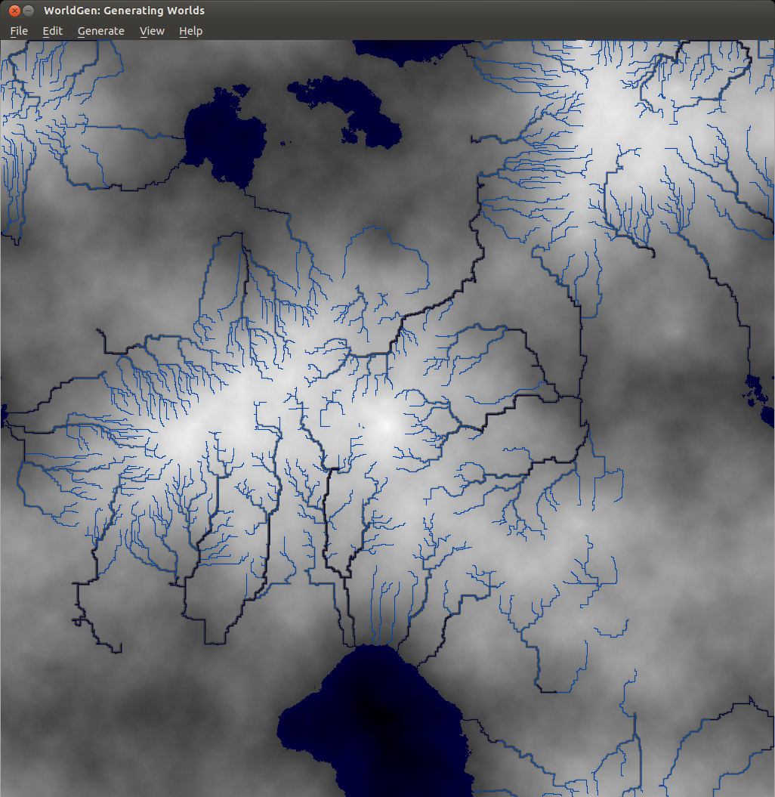

# Worldsynth 0.10.0 released

{ align=left width="200" }

Worldsynth version 0.10.0 is released and can be found on [github](https://github.com/psi29a/worldsynth/tags "Tagged Releases"). This is our first "official" release in which the result should work, out of the box, with a usable and familiar GUI instead of the pygame environment. This is provided by Qt4 via PySide. We have even tested Worldsynth on Windows XP to validate that it is indeed cross platform.

As for 0.11.0, we are looking to unlock size of terrain to be of any variable width and height instead of the basic power of two. We are also investigating fluvial erosion.

Here is a demo of the latest release:
https://www.youtube.com/watch?v=xgxS1MpVBeY

Some of the things changed in this release are:

Improved our just-in-time library loading so that only libraries are loaded as needed and were needed. This also helped to reduce the number of dependencies necessary for running Worldsynth.

We implemented an erosion model so that we can use it as an overlay over the original heightmap.

There is also now an overflow flag that treats the terrain generated as one that wraps. Rivers, for example, can flow off edges of maps, overflow into other side. This make the world seamless and one step closer to being able to wrap the terrain to a globe and having a world.

We also have a demonstration of Worldsynth running on Windows.
https://www.youtube.com/watch?v=QaHid9-etzo

Here are the files and libraries necessary to run Worldsynth on Windows:

- [python-2.7.3.msi](http://www.python.org/ftp/python/2.7.3/python-2.7.3.msi "python-2.7.3.msi")
- [setuptools-0.6c11.win32-py2.7.exe](https://pypi.python.org/packages/2.7/s/setuptools/setuptools-0.6c11.win32-py2.7.exe#md5=57e1e64f6b7c7f1d2eddfc9746bbaf20 "setuptools-0.6c11.win32-py2.7.exe")
- [pywin32-218.win32-py2.7.exe](http://sourceforge.net/projects/pywin32/files/pywin32/Build%20218/pywin32-218.win32-py2.7.exe/download "pywin32-218.win32-py2.7.exe")
- [numexpr-2.0.1.win32-py2.7.exe](http://numexpr.googlecode.com/files/numexpr-2.0.1.win32-py2.7.exe "numexpr-2.0.1.win32-py2.7.exe")
- [numpy-1.7.0.win32-py2.7.exe](https://pypi.python.org/packages/2.7/n/numpy/numpy-1.7.0.win32-py2.7.exe#md5=7ad31a61947cb91915eb0bfdb01d2ab8 "numpy-1.7.0.win32-py2.7.exe")
- [tables-2.2.1.win32-py2.7.exe](http://sourceforge.net/projects/pytables/files/pytables/2.2.1/tables-2.2.1.win32-py2.7.exe/download "tables-2.2.1.win32-py2.7.exe")
- [PySide-1.1.2.win32-py2.7.exe](http://releases.qt-project.org/pyside/PySide-1.1.2.win32-py2.7.exe "PySide-1.1.2.win32-py2.7.exe")
