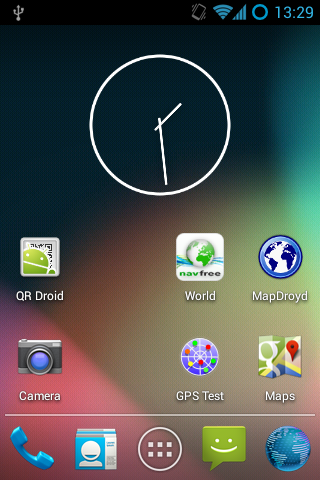
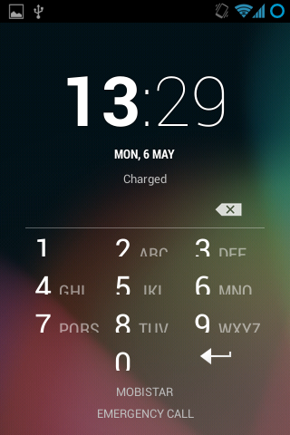
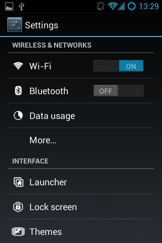
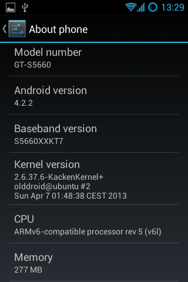
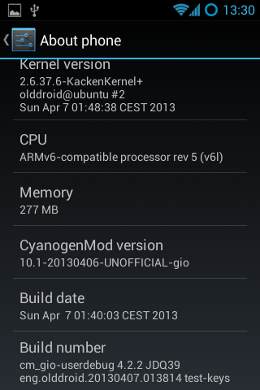
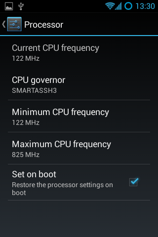
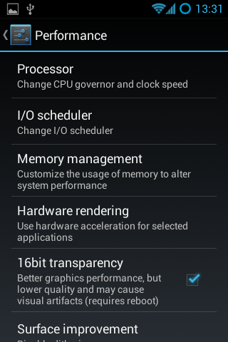
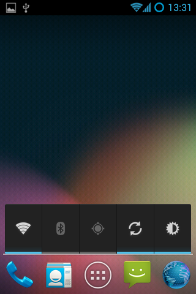
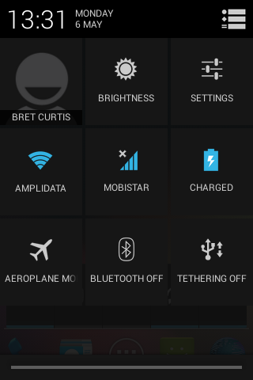

# Upgrade Samsung Galaxy Gio to CyanogenMod 10.1

{ align=left width="200" }

After about a year of Gingerbread (2.2.3) and CyanogenMod (7.2), I thought it was time again to look at further upgrades to my Galaxy Gio. This was apparently enough time for developers to work out problems involved in dealing with Ice Cream Sandwich (4.0.x) and Jelly Bean (4.[1-2].x) such as no ICS (or greater) libs and codecs from Qualcomm for the MSM7x27 family of chips for hardware acceleration.

Thanks to the Samsung Galaxy Gio community at xda-developers, we now have CyanogenMod (10.1) which is based on Jelly Bean (4.2.2) that is usable for every day use. There are a few things that I've noticed that are not perfect, but it is a fully usable ROM. Before you do anything suggested below, it is wise to first backup anything you think important and not just to your SD as it will be overwritten to support an extra ext4 partition that can be used to store your applications and save valuable space. Make sure your SD is rated 6 or better.

You will need a new version of the Clockworkmod recovery rom for your Gio that specifically supports Jelly Bean. You should read more about the [clockworkmod](http://forum.xda-developers.com/showthread.php?t=1894456 "clockworkmod") recovery image. Here is a [wiki](http://forum.xda-developers.com/wiki/ClockworkMod_Recovery "ClockworkMod_Recovery") to answer some of your questions about it.
**ClockworkMod installation procedure:**

1. Download to your sd-card the [cwm-6.0.2.7-itachiSan-ext4only.zip](http://www.mediafire.com/?lhnpax6bsra58x5 "cwm-6.0.2.7-itachiSan-ext4only.zip") (clockworkmod 6.0.2.7) as your recovery rom image.
2. Reboot into recovery mode, hold down the Home/OK (middle) button and press the Power button.
3. In recovery mode, use the Volume buttons for navigation and the Home/OK button for selecting.
4. Select “Update from SD card” from the recovery menu and drill down to cwm-6.0.2.7-itachiSan-ext4only.zip and press OK
5. Reboot again into recovery mode and you should now have the new CWM recovery screen.
6. Please wipe date/factory reset.
7. Once finished head down to advanced and then to partition sdcard. Select 4096M (or smaller if your SD card is not big enough) for your new ext4 partition and hit OK, then select your swap partition size of 256M (or 0 if you do not wish to use swap on SD card) and press OK to create your new partitions.
8. You are now ready to install CyanogenMod 10.1!

Once CWM is installed and you've created your new partitions, we should be ready to install CyanogenMod. The new partitions are purely optional, but I use them to help offset the Gio's memory is really small. You should have 3 partitions on your SD card, 1 that you can use to store applications on in ext4, 1 for swap and the last one is your normal fat32 partition. CM10.1 doesn't automatically make use of this, but I installed a separate application that makes the proper symlinks. It is advisable to install this application right after CM10.1 is installed. If you wish to read more about this particular blend of CynanogenMod, please follow the forums here:
[http://forum.xda-developers.com/showthread.php?t=1804646](http://forum.xda-developers.com/showthread.php?t=1804646 "xda-developers")

**Installation of CyanogenMod 10.1 for Samsung Gio**

1. Download last known good build:[cm-10.1.0-RC6-GT-S5660-gio.zip](http://jenkins.androidarmv6.org/view/All/job/android/306/artifact/archive/cm-10.1.0-RC6-GT-S5660-gio.zip "cm-10.1.0-RC6-GT-S5660-gio.zip") which has been thoroughly tested and widely installed.
   or
   Download last known stable build:[cm-10.1.6-GT-S5660-gio.zip](http://jenkins.androidarmv6.org/job/android/604/artifact/archive/cm-10.1.6-GT-S5660-gio.zip "cm-10.1.6-GT-S5660-gio.zip") is the latest build in the stable series. It is also reliable.
2. Copy the file to your SD card
3. Reboot into Recovery Mode (CWM)
4. Select install zip from sd card
5. Select "cm-10.1.\*-GT-S5660-gio.zip" ROM
6. Select Yes - Install update
7. Wait till the Installation is finish
8. Select 'wipe data/factory reset'
9. Select 'reboot mobile' and enjoy

After you have settled into your new Android version, head over to XDA and download a modified version of [S2E](http://forum.xda-developers.com/showthread.php?t=2098841 "S2E"). Install S2E from clockworkmod, reboot and configure it to your liking. I check everything but Application data for performance reasons. Once you have it configured how you like it, make sure that the status is enabled and you need to restart your mobile for settings to take effect.

The next thing you should look into is getting the "Developers Options" screen to appear in settings. By pressing the "Build number" in the about section 7 times, you'll get access to an important part of the phone. I go to the CPU functions and set the min to the lowest the CPU will go and highest to a 825Mhz with the Smartassh3 governor. This creates a very smooth experience and an extra bit of raw power on top when necessary.

Some addition tips to help manage your battery: turn off any services you don't need, don't use too many widgets, the widgets you do use should not interrupt deep sleep, keep brightness to medium.

Enjoy your "new" mobile! :)

**Update (20130625):** Since Olddroid's project is abandoned, I've switched to using Erika's build he is a member of the androidarmv6 team.

**Update (20131104):** I've been running latest release from androidarm6 team for about a month now, and it has been very stable. I've not had one single unexpected restart. Cheers! [cm-10.1.6-GT-S5660-gio.zip](http://jenkins.androidarmv6.org/job/android/604/artifact/archive/cm-10.1.6-GT-S5660-gio.zip "cm-10.1.6-GT-S5660-gio.zip")

**Note:**
Should you ever run into a situation where your mobile is unresponsive and possibly 'bricked', then you should have a look at this thread about "[one click unbricking](http://forum.xda-developers.com/showthread.php?t=1153310 "one click unbrick")" to try to get your mobile back in working order.

**This is part 3 of a 3 part series about the Galaxy Gio.
Part1: [Upgrade Samsung Galaxy Gio from 2.2.x Froyo to 2.3.x Gingerbread](https://mindwerks.net/2012/08/upgrade-samsung-galaxy-gio/ "Upgrade Samsung Galaxy Gio from 2.2.x Froyo to 2.3.x Gingerbread")
Part2: [Upgrade Samsung Galaxy Gio to CyanogenMod 7.2](https://mindwerks.net/2013/01/upgrade-samsung-galaxy-gio-to-cyanogenmod-7-2/ "Upgrade Samsung Galaxy Gio to CyanogenMod 7.2")
Part3: [Upgrade Samsung Galaxy Gio to CyanogenMod 10.1](https://mindwerks.net/2013/05/upgrade-samsung-galaxy-gio-to-cyanogenmod-10-1/ "Upgrade Samsung Galaxy Gio to CyanogenMod 10.1")**

**Here are screenshots of what to expect:**

{ align=left width="200" }

{ align=right width="200" }

{ align=left width="200" }

{ align=right width="200" }

{ align=left width="200" }

{ align=right width="200" }

{ align=left width="200" }

{ align=right width="200" }

{ align=left width="200" }
