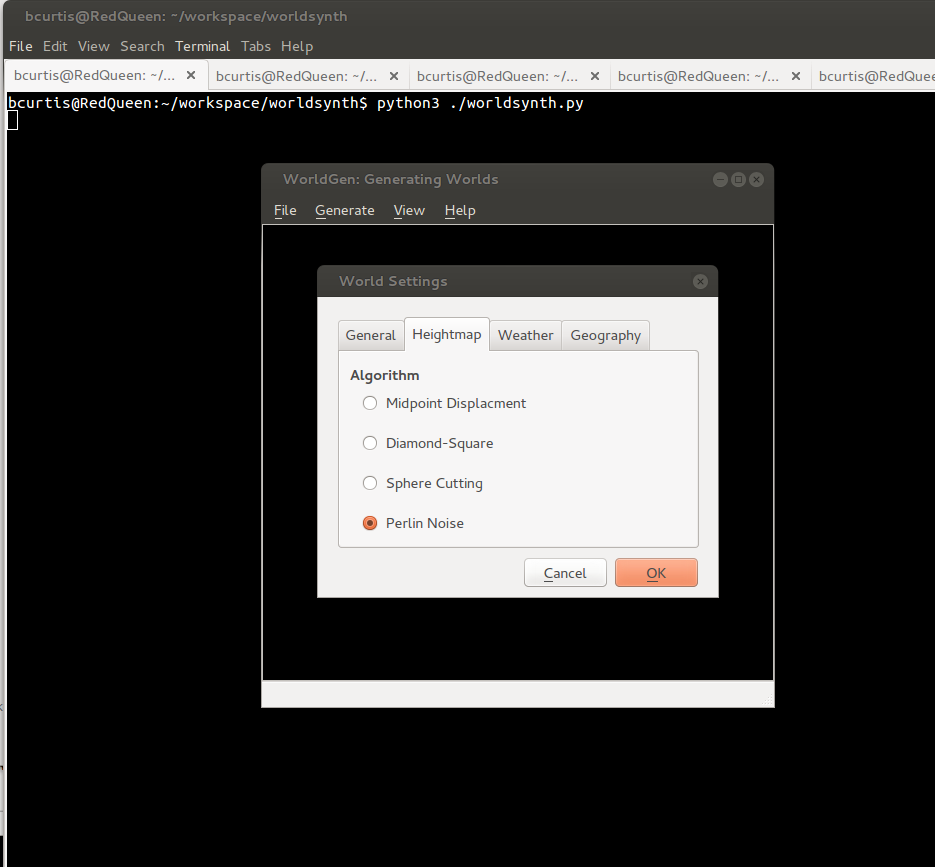
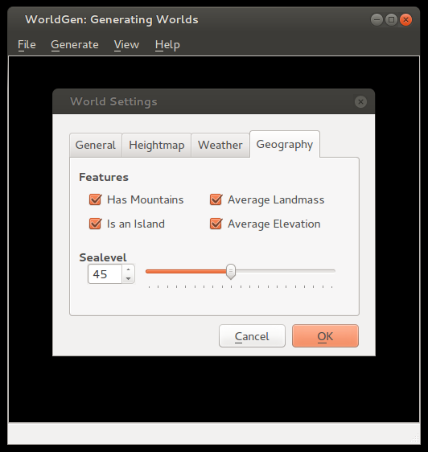
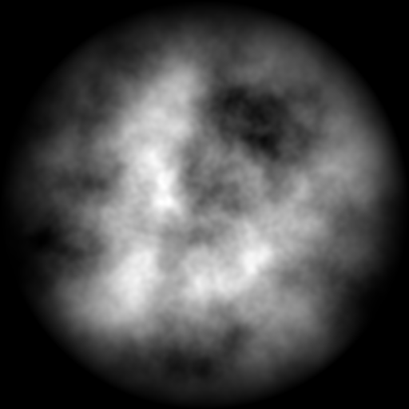
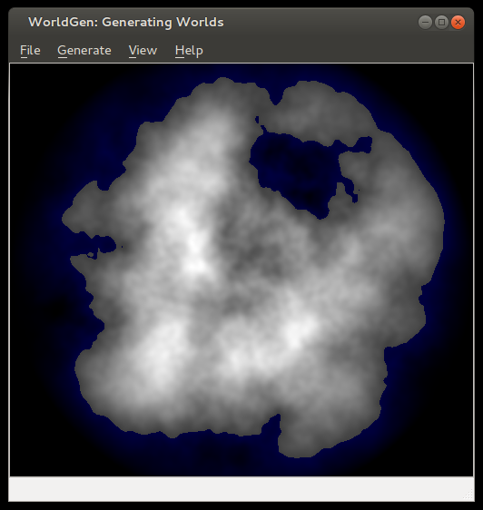
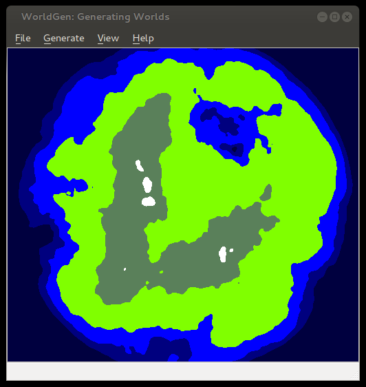

# Worldsynth 0.11.0 released

{ align=left width="200" }

Worldsynth version 0.11.0 is released and can be found on [github](https://github.com/psi29a/worldsynth/tags "Tagged Releases").

In this release we've added an additional algorithm for heightmap generation based on [Ken Perlin](http://en.wikipedia.org/wiki/Ken_Perlin "Ken_Perlin")'s work in [noise](http://en.wikipedia.org/wiki/Simplex_noise "Simplex_noise") generation. We decoupled the sea-level to be configurable based on percentage, which in addition to [masks](http://en.wikipedia.org/wiki/Image_mask#Image_masks) we can now create islands. You can also save your world and open it up later since we use pytables to store our settings, metadata and our data in an open [hdf5](http://en.wikipedia.org/wiki/Hierarchical_Data_Format) format. You can also export your heightmap in 16-bit PNG greyscale or even import from a wide array of images formats as a heightmap. Importing from an image creates a 16-bit precision greyscale heightmap. In addition to this, one commenter ask about Python3 support, well now you have it.

The immediate future of Worldsynth has the following: fluvial erosion, better river erosion, better river flow/snaking and editing properties of world.

Here are some screenshots of some of the latest features:

{ width="200" }

{ width="200" }

{ width="300" }

{ width="200" }

{ width="200" }
