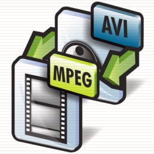

# Transcoding for mobiles

{ align=left width="200" }

There are times where I need a few films on my mobile for my son to watch. For my particular mobile "Galaxy Gio" the constraints for hardware acceleration is 360p as anything bigger will cause it to switch to software which is slower and sometimes a slideshow. For the uninitiated, 360p means either 480x360 at 4:3 ratio (your old TV) or 640x360 at 16:9 ratio (your HD TV).

First we need to cleanup our file names and sometimes 'rename' doesn't work properly. We list all files and separate them by commas and then parse line by line to first remove everything between () and then everything between []. We then move from the old name to the new name.
File name cleanup:
`` IFS=","; files=`ls --format commas | tr -d '\040\011\012\015'`; for file in $files; do newfile=`echo $file| sed 's/(.*)//' | sed 's/\[.*\]_//' | sed 's/_\[.*\]//' `; mv $file $newfile; done ``
The code above will try to remove spaces, and everything between () and [].

`` ls | while read -r FILE
do
mv -v "$FILE" `echo $FILE | tr ' ' '_' | tr -d '[{}(),\!]' | tr -d "\'" | tr '' '' | sed 's/_-_/_/g'`
done ``
The above code will convert all your spaces to underscores, remove characters like {}(),\! and convert the filename to lowercase.

`` ls | while read -r FILE
do
mv -v "$FILE" `echo $FILE | tr ' ' '_' `
done ``
The above just converts all spaces to underscores.

Mass encoding:
`` IFS=', '; set +x; for x in `ls --format commas | tr -d '\040\011\012\015'`; do height=`mediainfo $x | egrep -i "Height " | cut -d":" -f2 | sed 's/[^0-9]*//g'`; if [ $height -gt 360 ]; then name=`echo $x | sed 's/[^0-9]*//g'`; avconv -i $x -vcodec mpeg4 -acodec copy -scodec copy -threads 4 -vb 800000 -vf scale=640:360 series_name_${name}_SD.mkv; fi done ``

This last bit will go through your directory looking for media files who's height is greater than 360 and then transcode it to a lower resolution MKV file. Feel free to change MKV to AVI or whatever avconv supports as a container format. This keeps the original music, fonts and subtitles intact. By lowering the resolution, we match the screen resolution of the mobile and allow for hardware acceleration which will spare your battery. This has been incredibly handy during long flights with the kids.

**Update:**
Convert to xvid that converts the audio track to mp3, this helps with playback on low end hardware DVD players as well as mobiles.
`avconv -i something.HDTV.mkv -vcodec mpeg4 -vtag xvid -acodec libmp3lame -ab 128k -ac 2 -ar 44100 -scodec copy -threads 4 -vb 800000 -vf scale=640:360 something.HDTV.avi`

For aac (better quality and to preserve 5.1 audio):
`avconv -i something.HDTV.mkv -vcodec mpeg4 -vtag xvid -acodec aac -ab 192k -ar 44100 -strict expiremental -scodec copy -threads 4 -vb 800000 -vf scale=640:360 something.HDTV.avi`

Should you need to adjust the aspect ratio and/or scale down, there are tools available to help.
[Aspect Ratio Calculator](http://andrew.hedges.name/experiments/aspect_ratio/ "Aspect Ratio Calculator")
`avconv -i something.HDTV.mkv -vcodec mpeg4 -acodec aac -ab 192k -ar 44100 -strict expiremental -scodec copy -threads 4 -vb 800000 -aspect 45:22 -vf scale=640:313 something.HDTV.mkv`
