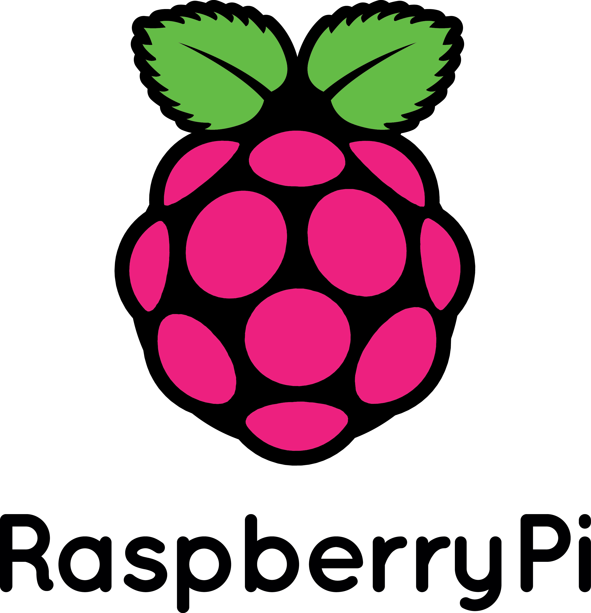

# Development on the Raspberry Pi

{ align=left width="200" }

Now that I'm a proud owner of a Raspberry Pi, I've being really stressing the little guy. There is only but so much a ARMv6 processor, on an microSD with only 512MiB of ram can do, which means that compiling on such a machine is going to take a really long time.

Take for example OpenMW, currently it takes about 4 minutes on a quad-core i7 to compile. You're in for a treat on the Pi, it will take you at least a day, two days if you realize that half-way through the OOM Killer came through and killed your cc process. This is about the time you start wondering about various ways to improve the situation, such as a larger swap file or using zram.

At this point, I was wondering about other ways compiling binaries and packages for the Pi. There was cross-compiling, but then I would have to set up a full toolchain and recompile all the packages from scratch. That will have to be for another post though as it is another world. Another option is to try virtualizing the Pi and apparently QEMU gets us pretty darn close.

Let us begin with the preparation of our environment. We'll get the latest Raspbian release and clean up it for use in a QEMU environment.

`# get the latest Raspbian:
wget http://downloads.raspberrypi.org/raspbian_latest`

# create new target image of about 20GiB and mount it
dd bs=1 count=0 seek=20G if=/dev/zero of=raspbian.img
sudo losetup -f --show raspbian.img

# mount downloaded raspbian image and copy over
sudo losetup -f --show 2014-06-20-wheezy-raspbian.img
sudo dd if=/dev/loop1 of=/dev/loop0
sudo losetup -d /dev/loop1

# resize partition, edit one file, and umount
sudo parted /dev/loop0 resizepart 2 20GB

# resize our filesystem
sudo partprobe /dev/loop0
sudo resize2fs /dev/loop0p2

# editing out shared lib preloading so that it fully boots
sudo mount /dev/loop0p2 /mnt/image
sudo sed -i s/'\/usr'/'#\/usr'/g /mnt/image/etc/ld.so.preload
cp /mnt/image/boot/kernel.img ~/kernel.img # used later in the custom built qemu
sync
sudo losetup -d /dev/loop0

At this point, you have an image for QEMU to use but now you have to choose. There are two routes:

- The default QEMU with only 256MiB of ram and a slightly different kernel than the Raspbian one because it uses a different CPU. The benefit here is that you don't have to do much, just apt-get install and you're on your way.
- The modified QEMU, that gives you native RPi support so you can use your Raspbian kernel. It also has 512MiB of ram, like the RPi B+ which helps with compiling. The only drawback currently is the lack of networking.

**First choice:**
`# get a kernel:
wget http://xecdesign.com/downloads/linux-qemu/kernel-qemu`

# fire up QEMU:
qemu-system-arm -kernel kernel-qemu -cpu arm1176 -m 256 -M versatilepb -no-reboot -serial stdio -append "root=/dev/sda2 panic=1 rootfstype=ext4 rw" -hda raspbian.img

**Second choice:**
`# setup build environment, configure and compile
sudo aptitude install libsdl-dev libfdt-dev git build-essential
git clone git://github.com/Torlus/qemu.git -b rpi
cd qemu
./configure --target-list="arm-softmmu arm-linux-user" --enable-sdl
make -j8`

# remember that kernel.img we copied earlier? We can use it here!

# run our newly made system
arm-softmmu/qemu-system-arm -M raspi -m 512 -sd ~/raspbian.img -kernel ~/kernel.img -append "earlyprintk loglevel=8 panic=120 keep\_bootcon rootwait dma.dmachans=0x7f35 bcm2708\_fb.fbwidth=1024 bcm2708\_fb.fbheight=768 bcm2708.boardrev=0xf bcm2708.serial=0xcad0eedf smsc95xx.macaddr=B8:27:EB:D0:EE:DF sdhci-bcm2708.emmc\_clock\_freq=100000000 vc\_mem.mem\_base=0x1c000000 vc\_mem.mem\_size=0x20000000 dwc\_otg.lpm\_enable=0 kgdboc=ttyAMA0,115200 console=tty1 elevator=deadline rootwait root=/dev/mmcblk0p2 panic=1 rootfstype=ext4 rw" -serial stdio -device usb-kbd -device usb-mouse -usbdevice net

At this point, you should have a usable Raspbian environment which should be faster than the real deal. Perfect for compiling and creating packages for your Raspberry Pi.

Happy hacking!
