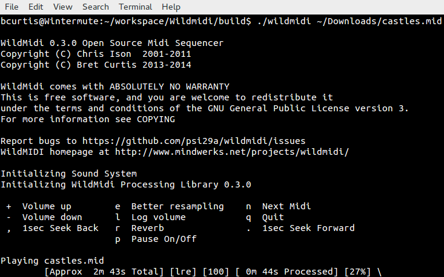

# WildMIDI 0.4 is here with support for other formats!

{ align=left width="200" }

**WildMIDI 0.4 is released!**

It has been two years in development and we’ve pushed [WildMIDI 0.4](https://github.com/Mindwerks/wildmidi/releases/tag/wildmidi-0.4.0) beyond just MIDI support, we’ve branched out into MIDI like files as well. We’ve worked together with other projects like [GStreamer](https://gstreamer.freedesktop.org/), [OpenTESArena](https://github.com/afritz1/OpenTESArena), [XLEngine](https://xlengine.com/) ([DaggerXL](https://xlengine.com/forums/viewtopic.php?f=2&t=1113)), [Thirdeye](https://github.com/psi29a/thirdeye), [ZDoom](https://zdoom.org/) and more to ask what we can do to make their lives easier, as a result we now support rendering, streaming and playback of many older MIDI-like formats!

**What’s new in this release**

We’ve added support for KAR (MIDI with Karaoke) files, [MIDI Type 2](https://en.wikipedia.org/wiki/MIDI#Standard_MIDI_files) and many MIDI-like formats such as [HMI](https://www.vgmpf.com/Wiki/index.php?title=HMI), [HMP](https://www.vgmpf.com/Wiki/index.php?title=HMP), [MUS (Id)](https://www.vgmpf.com/Wiki/index.php?title=MUS) and [XMI](https://www.vgmpf.com/Wiki/index.php?title=XMI)! We’ve also expanded our API in libwildmidi to support getting text/karaoke out of files, seeking songs in multi song MIDI Type 2, get errors instead of having a noisy library, setting conversion options, converting MIDI-like files into MIDI files and library now returns a buffer in the Endian format of the host.

**You’ll want to re-experience old game soundtracks:**

You probably still remember the soundtracks of your favorite games in their original OPL2, OPL3 or even MT32 glory, but now you’ll get to experience via a softsynth. Real guitars thrashing away on Doom’s opening anthem from e1m1 hangar or relax to the ambient Daggerfall soundtrack rendered by an orchestra. Here is a non-complete list of games that WildMIDI can use their native file formats to play back:

- 1992-03-?? XMI Ultima Underworld: The Stygian Abyss
- 1992-04-16 XMI Ultima VII: The Black Gate
- 1992-05-?? XMI The Legend of Kyrandia: Book One
- 1992-12-?? XMI Dune II: The Building of a Dynasty
- 1992-??-?? XMI Eye of the Beholder III: Assault on Myth Drannor
- 1992-??-?? XMI Battle Chess 4000
- 1992-??-?? XMI The Dark Queen of Krynn
- 1992-??-?? XMI Tetris Classic
- 1993-12-10 MUS Doom
- 1993-12-?? XMI Isle of the Dead
- 1993-??-?? XMI Dungeon Hack
- 1993-??-?? XMI The Legend of Kyrandia: Book Two – Hand of Fate
- 1993-??-?? XMI The Seven Cities of Gold
- 1993-??-?? XMI SimCity 2000
- 1993-??-?? XMI SimFarm
- 1993-??-?? XMI Wayne’s World
- 1994-04-01 MUS Raptor: Call of the Shadows
- 1994-05-06 HMP Magic Carpet
- 1994-09-23 XMI System Shock
- 1994-10-10 MUS Doom II: Hell On Earth
- 1994-11-19 XMI U.S. Navy Fighters
- 1994-12-23 MUS Heretic: Shadow of the Serpent Riders
- 1994-12-?? HMP Wing Commander III: Heart of the Tiger
- 1994-??-?? XMI The Settlers
- 1994-??-?? HMP Sensible Golf
- 1995-03-17 HMP Descent
- 1995-08-?? HMP Abuse
- 1995-09-30 MUS Hexen: Beyond Heretic
- 1995-10-30 HMP Whiplash (a.k.a. Fatal Racing)
- 1995-??-?? XMI Hi Octane
- 1995-??-?? HMI The Terminator: Future Shock
- 1996-03-13 HMP Descent II
- 1996-03-31 XMI ATF: Advanced Tactical Fighters
- 1996-05-15 MUS Strife
- 1996-08-31 HMI Daggerfall
- 1996-08-31 XMI The Settlers II
- 1996-11-30 XMI Rex Blade: The Battle Begins
- 1996-??-?? HMP Astérix & Obélix
- 1996-??-?? HMI The Terminator: SkyNET
- 1997-06-30 HMI Carmageddon
- 1997-07-15 HMI X-COM Apocalypse

Head on over to [Videogame Music Preservation Foundation](https://www.vgmpf.com/Wiki/index.php) track down your nostalgia!

**What others have been up to:**   
It seems that WildMIDI has been webified, over at [Wild Web Midi](https://zz85.github.io/wild-web-midi/) you can give them your MIDI file and they will stream or give you the resulting rendered file! You can look at their source code here: [wild-web-midi github account](https://github.com/zz85/wild-web-midi).

Great job guys!

**What to look forward to…**:

We would like to of course support more formats! So far on our list are: MMF, RMI, RDL, CMF, DRO, IMF and RDos.

Additional features also include SF2 and DLS support to help expand WildMIDI’s softsynth ability. There is also OPL3 emulation also known as a backup soundfont generator.

Support for AmigaOS and OpenBSD are also coming.

As was mentioned already, we’ve reached out to a few project to ask if there was anything we could help them with and now we want to extend that invitation to everyone. So if there is something you think WildMIDI should be supporting, let us know!

That’s it for this release, it was a huge and long one in coming. Now that the heavy lifting has finished, we can get back to smaller updates and shorter release cycle.

**WildMIDI Resources:**  
Release: [WildMIDI 0.4](https://github.com/Mindwerks/wildmidi/releases/tag/wildmidi-0.4.0)  
Issues: [WildMIDI Issue Tracker](https://github.com/Mindwerks/wildmidi/issues)
