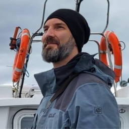

# Bret Curtis

{ align=left width="200" }

I grew up in Virginia, close to Washington D.C. and hold an [Academic Bachelor](http://en.wikipedia.org/wiki/Bachelor%27s_degree#Computer_science_and_information_systems) in Computer Science from [University of Mary Washington](https://www.umw.edu/).

I have been in IT/ICT professionally since 2001, mostly as a Linux specialist, and in that time I have worked for an ISP as a [systems administrator](https://en.wikipedia.org/wiki/System_administrator "Systems Administrator"), [software engineer](https://en.wikipedia.org/wiki/Software_engineer "Software Engineer") for start-up companies, as an independent consultant and as a [Systems Engineer](https://en.wikipedia.org/wiki/Systems_engineering "Systems Engineer").

In my spare time I have also contributed to many Free and Open Source Software projects.

- [OpenMW](https://openmw.org/ "OpenMW"): Project lead for the open-source engine reimplementation of [Morrowind](https://en.wikipedia.org/wiki/OpenMW "OpenMW"), developed on [GitLab](https://gitlab.com/OpenMW/openmw "OpenMW on GitLab").
- My own [projects](projects/worldsynth.md "Projects")
- [Gentoo Linux](https://en.wikipedia.org/wiki/Gentoo_Linux "Gentoo Linux"): Testing and porting software to work on [MIPS](https://en.wikipedia.org/wiki/MIPS_architecture "MIPS") based hardware from [Silicon Graphics Inc](https://en.wikipedia.org/wiki/Silicon_Graphics "Silicon Graphics") and [Cobalt Networks](https://en.wikipedia.org/wiki/Cobalt_Networks).
- [Debian Linux](https://en.wikipedia.org/wiki/Debian "Debian/Linux"): [Package maintainer](https://qa.debian.org/developer.php?login=psi29a@gmail.com "Package Maintainer") and cross-platform specialist.
- My [Github](https://github.com/psi29a "Github") page

Currently I live and work in [Gent](https://en.wikipedia.org/wiki/Ghent), Belgium as a Software Engineer for [DoubleVerify](https://doubleverify.com/company/locations/belgium "DoubleVerify"). While not at work, I'm a family man who loves playing board-games with my children and friends.

You can contact me professionally via my linkedin [Bret Curtis](https://www.linkedin.com/in/bretecurtis) profile.
