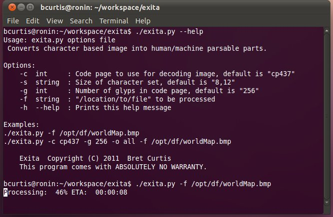

# Exita: Export Image to Ascii

{ align=left width="200" }

*Exita* is a data export tool that functions like an [OCR](http://en.wikipedia.org/wiki/Optical_character_recognition) application but for a specific character set.

**How:** *Exita* reads in an image and breaks it apart into cells based on the height and width of the character set bitmap used (e.g. cp437-8x12). With each cell in an image, it tries to find a match and return the proper text character.

**Exceptions:** Some character sets like [cp437](http://en.wikipedia.org/wiki/Code_page_437) have dual-use characters that have a glyph when printed but are also used as control characters. These are handled by the "special characters" module which can be extended to support more character sets.

**License and Use:** *Exita* is [LGPLv2](http://en.wikipedia.org/wiki/GNU_Lesser_General_Public_License) software and you are free to download, modify and use it. All I ask in return are any patches, bug reports and suggestions that you have. [Github](https://github.com/psi29a/exita) provides an issue tracking system [here](https://github.com/psi29a/exita/issues).

Download:

- Source: [Github](https://github.com/psi29a/exita)
- Linux binary (coming soon)
- Windows binary (coming soon)

**Uses:**  Exita is now linked to by the [Dwarf Fortress Wiki](http://df.magmawiki.com/index.php/Main_Page) in their [Utilities](http://df.magmawiki.com/index.php/Utilities) section as a DF map exporter.
