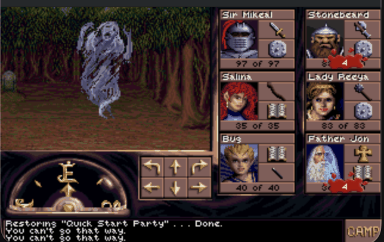
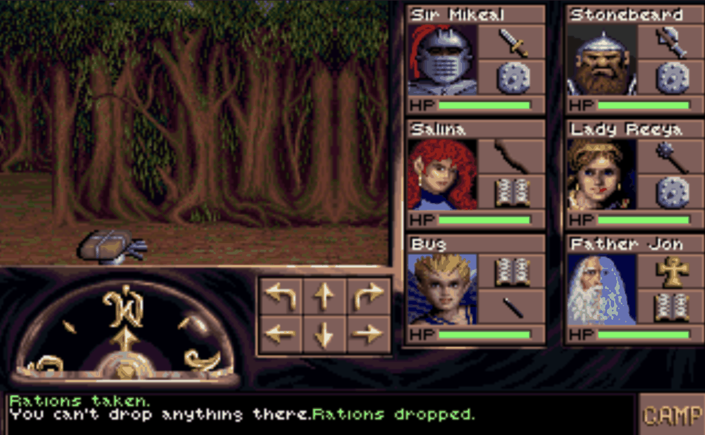
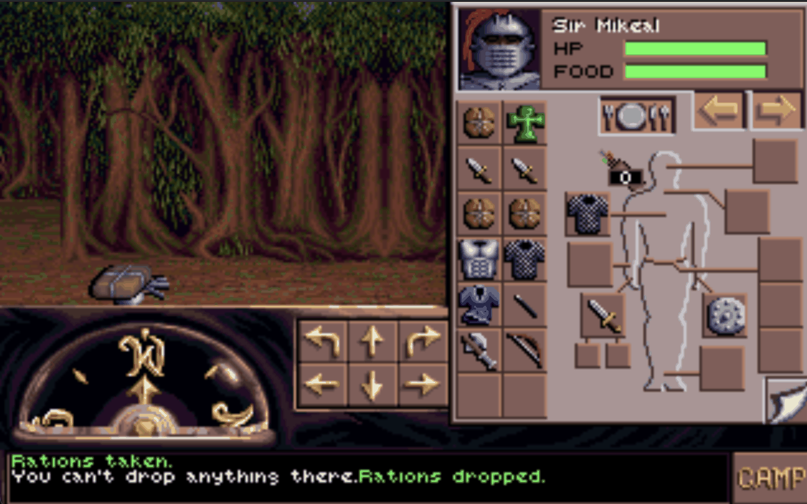

# Thirdeye: An AESOP Replacement Engine

{ align=left width="200" }

**Thirdeye** is a from-scratch C++ reimplementation of SSI/Westwood's AESOP (An Extensible State-Object Processor) engine — both AESOP/16 and AESOP/32 — the bytecode VM behind the early-90s RPGs "Eye of the Beholder 3" and "Dungeon Hack". John Miles created AESOP as a high level scripting language and the supporting 16-bit real-mode interpreter and state engine in the early 90s but due to the hardware requirements at the time, it ran poorly. You could be waiting up to 10 seconds for the next update. It seemed like a nice fit to try to implement a working binary replacement for AESOP and make it open-source in the process.

The goal is to play both games natively from the original game data. Thirdeye ships no game assets, so you must own the original games.

**Reason:** I am interested in old file formats, those created or used by old programs that no longer run on modern operating systems and hardware. Their documentation no longer exists and the original designers are either enjoying retirement or have passed on. In this particular case, there was already bits of reverse engineering occurring on the file formats and in this case, John released his documentation and some of the AESOP code (that was his) to the public domain. This is partially porting and reverse engineering 20 year old code and resources which seems a bit more digital archaeology.

**Current state:**

Both games are playable. Eye of the Beholder 3 boots, fights, loots and saves; Dungeon Hack runs end to end from its own menus, with MAZE.EXE reimplemented natively so dungeons are generated in-process. Save files stay byte-compatible with the DOS originals.

- Full AESOP bytecode VM, state engine and opcode dispatch
- Combat, monster AI, item pickup and inventory
- Character generation and save/load, including EOB2 party transfer
- 3D dungeon view with occlusion, HUD, cutscenes and chargen screens
- Dungeon Hack maze generation, including its R250 PRNG and all five layout algorithms

**Quality-of-life additions beyond the DOS release:**

- Automap (press M) with fog of war, persisted per save slot
- WASD/QE movement alongside the original arrow keys and mouse
- Windowed play at any integer scale
- `--skip-intro` / `--skip-menu` / `--load-save=N` to jump straight in
- A Qt6 launcher that picks the game folder, sets options, checks for updates and can download and install the game data
- Built-in OPL3 synth for authentic AdLib/SB16 music with no soundfont or patch setup
- Atomic, crash-safe saving

**Screenshots:**

Eye of the Beholder 3 running natively in Thirdeye — the party in the dungeon view with dropped loot on the floor, and Sir Mikeal's inventory screen.

**Requirements to build:**

CMake >= 3.15 and a C++20 compiler (GCC 10+, Clang 12+, or MSVC 2019+)

Libs: SDL3, OpenAL and [WildMidi](wildmidi.md "WildMIDI")

**Issues, Bugs, Todo and Wiki:**
[Milestones](https://github.com/psi29a/thirdeye/milestones "Milestones")
[Issue Tracker](https://github.com/psi29a/thirdeye/issues "https://github.com/psi29a/thirdeye/issues")
[Wiki](https://github.com/psi29a/thirdeye/wiki "https://github.com/psi29a/thirdeye/wiki")

**Downloads**
Source: [https://github.com/psi29a/thirdeye](https://github.com/psi29a/thirdeye "Thirdeye")
Releases: [https://github.com/psi29a/thirdeye/releases](https://github.com/psi29a/thirdeye/releases "Thirdeye Releases")

Packaged builds are available for Linux (.AppImage and .deb), macOS (.dmg) and Windows (NSIS installer).
