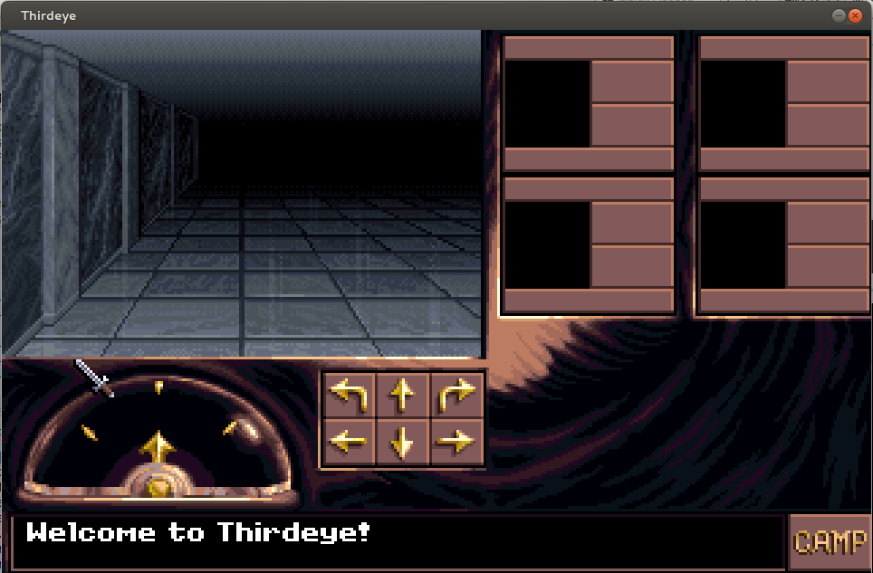

# Thirdeye: An AESOP Replacement Engine

{ align=left width="200" }

**Thirdeye** is an attempt at recreating the AESOP (An Extensible State-Object Processor) engine which was most popularly used by the RPGs "Eye of the Beholder: 3" and "Dungeon Hack" of the early 90s. John Miles created AESOP as a high level scripting language and the supporting 16-bit real-mode interpreter and state engine in the early 90s but due to the hardware requirements at the time, it ran poorly. You could be waiting up to 10 seconds for the next update. It seemed like a nice fit to try to try to implement a working binary replacement for AESOP and make it open-source in the process.

**Reason:** I am interested in old file formats, those created or used by old programs that no longer run on modern operating systems and hardware. Their documentation no longer exists and the original designers are either enjoying retirement or have passed on. In this particular case, there was already bits of reverse engineering occurring on the file formats and in this case, John released his documentation and some of the AESOP code (that was his) to the public domain. This is partially porting and reverse engineering 20 year old code and resources which seems a bit more digital archaeology.

**What works:**

- Reading RES and GFF files
- Rendering of BMP files
- Rendering of FNT (fonts)
- Playback of SND and XMI files
- Basic playback of BMA files
- DAESOP fully ported
- ARC partially ported

**What doesn't:**

- MAZ decoding
- OPCODE decoding
- Chargen support
- CPS rendering
- State engine/interpreter

**Screenshots:**

**Issues, Bugs, Todo and Wiki:**
[Milestones](https://github.com/psi29a/thirdeye/issues/milestones "Milestones")
[Issue Tracker](https://github.com/psi29a/thirdeye/issues "https://github.com/psi29a/thirdeye/issues")
[Wiki](https://github.com/psi29a/thirdeye/wiki "https://github.com/psi29a/thirdeye/wiki")

**Requirements to build:**
VC2012 or GCC
Libs: SDL2, [WildMidi](http://www.mindwerks.net/projects/wildmidi/ "WildMIDI") and OpenAL

**Downloads**
Source: [https://github.com/psi29a/thirdeye](https://github.com/psi29a/thirdeye "Thirdeye")
Releases: [https://github.com/psi29a/thirdeye/tags](https://github.com/psi29a/thirdeye/tags "Thirdeye Releases")
